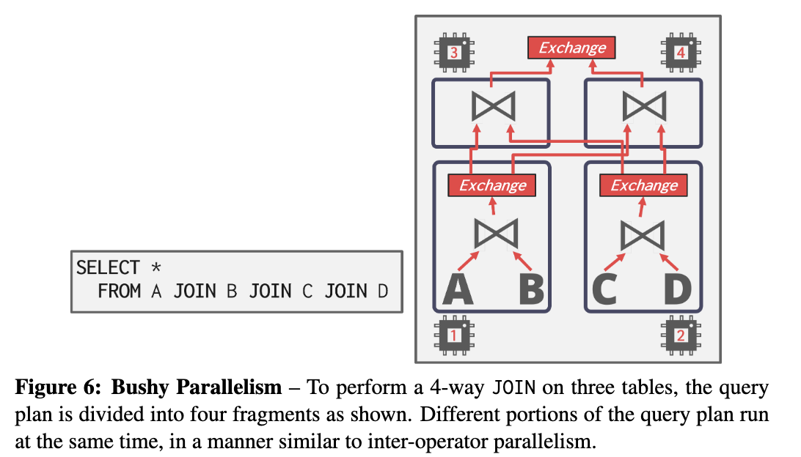
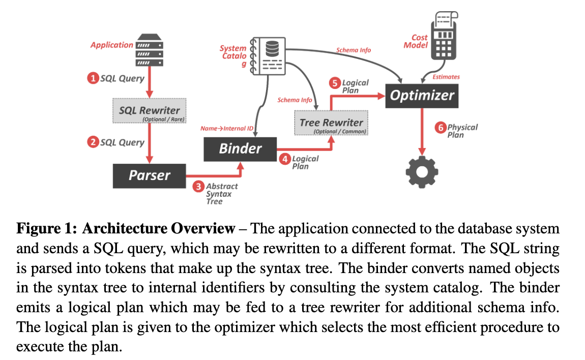
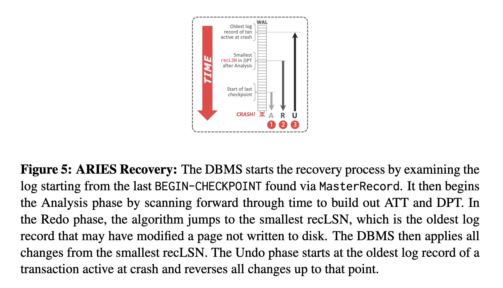
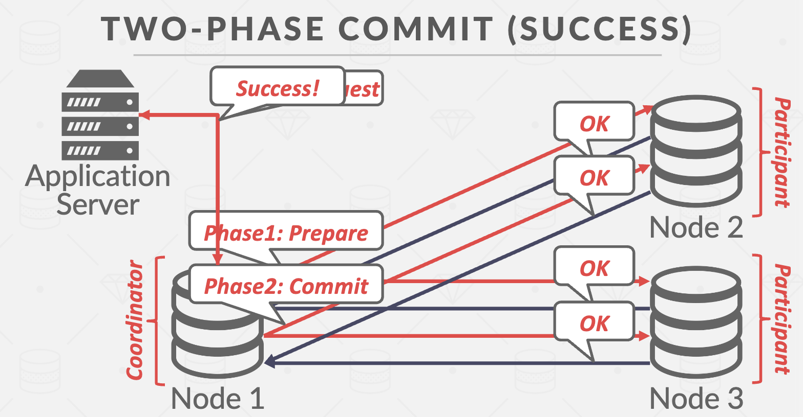

# NOTES

## lec2: Modern SQL

### sql的分类

1. Data Manipulation Language (DML): SELECT, INSERT, UPDATE, and DELETE statements.
2. Data Definition Language (DDL): Schema definitions for tables, indexes, views, and other objects.
3. Data Control Language (DCL): Security, access controls.

> Example database
>
> ```sql
> CREATE TABLE student (
>   sid INT PRIMARY KEY,
>   name VARCHAR(16),
>   login VARCHAR(32) UNIQUE,
>   age SMALLINT,
>   gpa FLOAT
> );
> CREATE TABLE course (
>   cid VARCHAR(32) PRIMARY KEY,
>   name VARCHAR(32) NOT NULL
> );
> CREATE TABLE enrolled (
>   sid INT REFERENCES student (sid),
>   cid VARCHAR(32) REFERENCES course (cid),
>   grade CHAR(1)
> );
> ```

### Joins

Example: Which students got an A in 15-721?

```sql
SELECT s.name
	FROM enrolled AS e, student AS s
		WHERE e.grade = 'A' AND e.cid = '15-721'
		AND e.sid = s.sid
```

### Aggregates

- 聚合函数接受一些tuple作为其输入，然后生成一个标量值作为其输出

- 聚合函数（几乎）只能在 SELECT 输出列表中使用。 
  - AVG(COL)：COL 中值的平均值 
  - MIN(COL)：COL 中最小值 
  - MAX(COL)：COL 中最大值 
  - COUNT(COL)：关系中元组的数量

以下三个sql等价：

```sql
SELECT COUNT(*) FROM student WHERE login LIKE '%@cs';
SELECT COUNT(login) FROM student WHERE login LIKE '%@cs';
SELECT COUNT(1) FROM student WHERE login LIKE '%@cs';
```

一个SQL语句可以包括多个聚合函数：

```sql
/* Get # of students and their average GPA with a ‘@cs’ login */
SELECT AVG(gpa), COUNT(sid)
FROM student WHERE login LIKE '%@cs';
```

一些聚合函数（例如 COUNT、SUM、AVG）支持 DISTINCT 关键字:

```sql
# Get # of unique students and their average GPA with a ‘@cs’ login
SELECT COUNT(DISTINCT login)
FROM student WHERE login LIKE '%@cs';
```


#### 1. window function

当使用SQL中的窗口函数（window function）时，您可以对查询结果集中的一组行应用聚合函数或分析函数，而无需将查询结果分组。窗口函数可以用于计算每个行的聚合值或提取有关行的统计信息，而不会修改结果集的行数。

窗口函数与常规聚合函数（如SUM、AVG、MAX、MIN）不同，它们通过在函数后面添加OVER子句来标识。OVER子句定义了窗口的范围，即要在哪些行上计算聚合或分析函数。

窗口函数的语法结构如下：
```
<窗口函数>(<表达式>) OVER ([PARTITION BY <列1>, <列2>, ...]
                          [ORDER BY <排序列> [ASC | DESC]]
                          [<窗口帧定义>])
```

窗口函数的核心部分是窗口帧定义，它确定哪些行应该被包含在计算中。窗口帧定义有以下几种常见的形式：
- 不带窗口帧定义：计算整个分区内的所有行。
- ROWS BETWEEN <start> AND <end>：指定一个范围，例如从当前行向前或向后的N行。
- RANGE BETWEEN <start> AND <end>：根据值的大小指定一个范围，而不是特定的行数。

常见的窗口函数包括：
- ROW_NUMBER()：为每行分配一个唯一的整数行号。
- RANK()：计算每行的排名，相同值的行具有相同的排名，跳过相应的排名。
- DENSE_RANK()：计算每行的密集排名，相同值的行具有相同的排名，不跳过相应的排名。
- SUM()、AVG()、MIN()、MAX()：计算指定列或表达式的聚合值。

以下是一些例子：

1. 计算每个销售员的销售总额和平均销售额：
```sql
SELECT salesperson, sales_amount,
       SUM(sales_amount) OVER (PARTITION BY salesperson) AS total_sales,
       AVG(sales_amount) OVER (PARTITION BY salesperson) AS avg_sales
FROM sales_table;
```

2. 获取每个部门的销售排名：
```sql
SELECT department, sales_amount,
       RANK() OVER (PARTITION BY department ORDER BY sales_amount DESC) AS sales_rank
FROM sales_table;
```

3. 计算每个月的累计销售额：
```sql
SELECT month, sales_amount,
       SUM(sales_amount) OVER (ORDER BY month) AS cumulative_sales
FROM sales_table;
```

4. 查找每个产品类别的销售额占比：
```sql
SELECT product_category, sales_amount,
       sales_amount / SUM(sales_amount) OVER () AS sales_percentage
FROM sales_table;
```

5. 获取每个用户的前两个订单：
```sql
SELECT user_id, order_id, order_date,
       ROW_NUMBER() OVER (PARTITION BY user_id ORDER BY order_date) AS row_num
FROM orders_table
WHERE row_num <= 2;
```

这些示例只是窗口函数的一小部分应用，窗口函数的灵活性使其能够进行更复杂的数据分析和处理操作。根据具体的需求，您可以使用窗口函数来执行各种聚合、排序、分组和排名操作

6. ```sql
   SELECT cid, sid, ROW_NUMBER() OVER (PARTITION BY cid)
   FROM enrolled ORDER BY cid;
   ```

这条 SQL 查询语句使用了窗口函数 `ROW_NUMBER()` 来为每个 `cid` 分区中的行分配一个序号。

- `SELECT cid, sid`: 查询结果将包含 `cid` 和 `sid` 两个列。
- `ROW_NUMBER() OVER (PARTITION BY cid)`: 这是窗口函数的部分。它定义了一个窗口，并对每个 `cid` 进行分区。对于每个分区内的行，窗口函数 `ROW_NUMBER()` 将为其分配一个序号。每个分区的序号从 1 开始递增。
- `FROM enrolled`: 这是数据源表，它包含了 `cid` 和 `sid` 列。
- `ORDER BY cid`: 结果集按照 `cid` 列进行升序排序。

因此，这条 SQL 查询语句的目的是为了在 `enrolled` 表中获取每个 `cid` 分区内的行，并为每个分区内的行分配一个序号。结果集将包含 `cid`、`sid` 和序号列。

7. Find the student with the second highest grade for each course

```sql
SELECT * FROM (
	SELECT *, RANK() OVER (PARTITION BY cid
			ORDER BY grade ASC) AS rank
		FROM enrolled) AS ranking
WHERE ranking.rank = 2;
```

这条 SQL 查询语句使用了窗口函数 `RANK()` 来为每个 `cid` 分区中的行计算一个排名，并筛选出排名为 2 的行。

- `SELECT *`: 查询结果将包含表中的所有列。
- `FROM (SELECT *, RANK() OVER (PARTITION BY cid ORDER BY grade ASC) AS rank FROM enrolled) AS ranking`: 这是一个子查询，它首先对 `enrolled` 表进行查询，并在查询结果的基础上应用窗口函数 `RANK()`。`RANK()` 函数按照 `cid` 进行分区，并根据 `grade` 列的升序对每个分区内的行进行排名。结果集中的每一行都包含了原始表中的所有列以及一个名为 `rank` 的列，该列表示每个行在其分区中的排名。
- `WHERE ranking.rank = 2`: 这是对子查询结果的过滤条件，它筛选出排名为 2 的行。

因此，这条 SQL 查询语句的目的是在 `enrolled` 表中找到每个 `cid` 分区内排名为第 2 的行，并返回这些行的所有列。

#### 2. select 1

在 SQL 中，`SELECT 1` 是一种常见的用法，它的含义是选择一个常量值 1 作为查询结果的一列。

通常情况下，使用 `SELECT 1` 的目的是为了检查查询是否返回了至少一行结果，而不关心具体的列或数据。这种用法常用于条件判断或简单的存在性检查。

例如，可以使用 `SELECT 1` 来检查表中是否存在满足某个条件的行：

```sql
SELECT 1
FROM your_table
WHERE your_condition;
```

如果查询返回了至少一行结果，表示条件满足；如果查询没有返回任何结果，则条件不满足。

另外，有时也可以使用 `SELECT 1` 作为子查询的一部分，以占位符的形式出现在复杂的查询中，其中实际的查询逻辑可能更复杂。在这种情况下，选择 `1` 是一种惯例，表示子查询的结果集不重要，只需返回一个值作为占位符。

#### 3. resursive in CTE

在 SQL 中，CTE（Common Table Expression）是一种临时命名的查询结果集，它类似于子查询，但具有更清晰和可重用的语法。CTE 可以在一个查询中定义并被后续的查询引用。

使用 CTE 可以更好地组织复杂的查询逻辑，提高查询的可读性和可维护性。通常情况下，CTE 可以定义为非递归的，即每个 CTE 只参考自身之前的结果。

然而，有时候需要使用递归查询来处理层次化的数据结构，这时可以使用 RECURSIVE 关键字来定义递归的 CTE。

语法上，使用 RECURSIVE 关键字后，CTE 中的初始查询称为 "anchor member"，之后的递归查询称为 "recursive member"。递归查询可以参考之前的结果集，形成递归循环，直到满足退出条件为止。

下面是一个示例：

```sql
WITH RECURSIVE cte_name (column1, column2, ...) AS (
    -- Anchor member (初始查询)
    SELECT initial_column1, initial_column2, ...
    FROM initial_table
    WHERE initial_condition

    UNION ALL

    -- Recursive member (递归查询)
    SELECT recursive_column1, recursive_column2, ...
    FROM recursive_table
    JOIN cte_name ON join_condition
    WHERE recursive_condition
)
SELECT *
FROM cte_name;
```

在上述示例中，使用 RECURSIVE 关键字定义了一个递归的 CTE。初始查询（Anchor member）从 initial_table 中选择一些行，并应用 initial_condition 进行过滤。然后，递归查询（Recursive member）基于 recursive_table 的数据，并与之前的 CTE 结果集（cte_name）进行连接。递归查询中的 join_condition 和 recursive_condition 决定了递归循环的退出条件。

最后，可以在查询中引用 cte_name，以获取递归查询的结果。

递归查询常用于处理树状或层次化数据结构，如组织结构、文件目录等。

**example**：打印1-10

```sql
WITH RECURSIVE cteSource (counter) AS ( 
  ( SELECT 1 )
		UNION
  ( SELECT counter + 1 FROM cteSource
  WHERE counter < 10 )
)
SELECT * FROM cteSource;
```


## lec5

#### 1. Bitmap Encoding

Bitmap Encoding（位图编码）是一种数据压缩技术，用于有效地表示和存储包含大量布尔值或离散状态的数据集合。它使用位图数据结构来表示数据集合，其中每个位（bit）表示一个元素的状态（存在或不存在）。

下面是一个示例来解释Bitmap Encoding的工作原理。假设我们有一个包含10个整数的数据集合：{3, 6, 9, 12, 15, 18, 21, 24, 27, 30}。我们可以使用Bitmap Encoding来表示该数据集合。

首先，创建一个位图，位图的长度等于数据集合中最大元素的值加1。在这个例子中，最大值是30，所以我们创建一个长度为31的位图。

```
位图： 0 0 0 0 0 0 0 0 0 0 0 0 0 0 0 0 0 0 0 0 0 0 0 0 0 0 0 0 0 0 0 0
```

接下来，对于数据集合中的每个元素，将位图中对应位置的位设置为1，表示该元素的存在。例如，对于元素3，我们将位图中索引为3的位置设置为1。

```
位图： 0 0 0 1 0 0 0 0 0 0 0 0 0 0 0 0 0 0 0 0 0 0 0 0 0 0 0 0 0 0 0 0
```

按照相同的方式，对其他元素进行设置。

```
位图： 0 0 0 1 0 0 1 0 0 0 1 0 0 0 1 0 0 0 1 0 0 1 0 0 0 1 0 0 0 1 0 0
```

现在，我们可以通过检查位图中的位来判断数据集合中的元素是否存在。如果位图中某个位置的位为1，则表示对应的元素存在于数据集合中。

Bitmap Encoding的优点是可以使用很小的存储空间来表示大型数据集合，因为每个元素只需要一个位来表示。它适用于那些具有稀疏性的数据集合，其中只有部分元素存在。

然而，Bitmap Encoding的缺点是对于大范围的元素值会导致位图变得非常长，并消耗大量的存储空间。另外，当数据集合的更新频繁时，位图的更新操作可能会变得昂贵。因此，在具体应用中需要权衡存储空间和更新操作的需求，判断是否适合使用Bitmap Encoding来表示数据集合。


## lec6

#### 1. Latches

在数据库中，Latches是一种同步机制，用于管理对数据库内部数据结构的并发访问。它们是一种轻量级的锁，用于保护共享数据结构的一致性和完整性。

Latches通常用于控制对数据库缓冲区、索引结构、事务控制块等关键数据结构的并发访问。数据库系统中的多个并发事务可能需要同时读取或修改这些数据结构，而Latches可以确保数据结构在并发访问时保持一致性，避免数据损坏或不一致的情况发生。

数据库中的Latches通常是基于硬件原语或操作系统提供的原子操作实现的。它们可以实现不同的模式，如共享模式（Shared Mode）和独占模式（Exclusive Mode），以适应不同的并发访问需求。在共享模式下，多个事务可以同时获取Latch进行读取操作；而在独占模式下，只有一个事务可以获取Latch进行写入操作，其他事务需要等待。

Latches在数据库系统中起着重要的作用，可以提高并发性能并确保数据的一致性。它们通常与其他同步机制（如锁和条件变量）一起使用，以实现数据库的并发控制和并发事务处理。

#### 2. **Buffer Pool Optimizations**：**Scan Sharing (Synchronized Scans)**

在数据库中，Scan Sharing（或称为Synchronized Scans）是一种优化技术，用于并发执行查询操作时共享扫描结果的过程。它可以减少重复扫描和资源浪费，提高查询性能和系统吞吐量。

通常情况下，多个查询可能会涉及相同的数据集，并且每个查询都需要对数据集进行扫描以获取所需的结果。这可能导致重复的扫描操作，浪费了系统资源和时间。而Scan Sharing技术旨在避免这种重复扫描的情况，通过共享扫描结果来提高查询的效率。

在Scan Sharing中，当一个查询开始扫描数据集时，它会将扫描结果存储在共享的缓存或数据结构中。其他需要相同数据集的查询可以直接访问这个共享的扫描结果，而无需重新扫描数据集。这样可以减少IO操作和CPU消耗，提高查询的响应速度和系统的整体性能。

举个例子，假设有一个数据库中的表格包含大量的用户信息。多个查询需要根据用户的条件进行过滤和统计。如果每个查询都单独扫描整个表格来获取符合条件的用户数据，会产生大量的IO操作和计算开销。但是如果使用Scan Sharing技术，第一个查询开始扫描并筛选用户数据时，它可以将扫描结果存储在一个共享的缓存中。随后的查询可以直接访问这个缓存来获取已经筛选好的结果，避免了重复扫描的开销，提高了查询的效率。

需要注意的是，Scan Sharing技术在某些情况下可能并不适用。例如，当数据集发生变化或查询之间存在冲突时，共享的扫描结果可能会失效，需要重新扫描或更新。因此，在实现Scan Sharing时需要考虑数据的一致性和并发控制的问题，以保证查询结果的正确性。

#### 3. **Buffer Pool Optimizations**：**Buffer Pool Bypass**

在某些情况下，使用缓冲池会引入额外的开销，例如：

1. 数据访问模式：对于某些具有特定数据访问模式的查询，如顺序扫描或大范围扫描，缓冲池的数据查找和维护开销可能超过了直接从磁盘读取数据的开销。
2. 数据大小：对于大型数据对象或大数据集的查询，缓冲池可能无法容纳全部数据，导致频繁的磁盘IO操作和缓冲池的淘汰。

在这些情况下，可以使用Buffer Pool Bypass技术来绕过缓冲池，直接从磁盘读取数据。通过绕过缓冲池，可以减少缓冲池的查找和维护开销，提高查询的性能和响应速度

#### 4. OS Page Cache

> Most DBMS use direct I/O to bypass the OS’s cache in order to avoid redundant copies of pages and having to manage different eviction policies.

当数据库管理系统（DBMS）使用直接I/O（Direct I/O）来绕过操作系统的缓存时，它的目的是避免数据页的冗余拷贝以及需要管理不同的驱逐策略。

传统上，操作系统会在内核缓存中维护一个页缓存（Page Cache）来缓存磁盘上的数据页。当应用程序或DBMS需要读取或写入数据时，数据会首先从磁盘加载到操作系统的页缓存中，然后再从页缓存复制到应用程序或DBMS的缓冲区中。这种过程中涉及了两次数据拷贝：磁盘到页缓存的拷贝和页缓存到应用程序或DBMS缓冲区的拷贝。

为了避免这两次冗余的数据拷贝，以及降低缓存管理的复杂性，DBMS可以选择使用直接I/O来绕过操作系统的缓存。==直接I/O是一种通过绕过操作系统的页缓存，直接将数据读取或写入磁盘的方法==。

使用直接I/O带来以下几个好处：

1. 减少数据拷贝：通过绕过页缓存，直接将数据读取或写入磁盘，避免了数据在缓存和应用程序或DBMS之间的额外拷贝。这可以提高I/O操作的效率和性能。

2. 避免缓存管理开销：操作系统的页缓存需要管理缓存页的驱逐策略、缓存一致性和数据同步等。通过绕过页缓存，DBMS可以避免涉及到缓存管理的开销，简化了系统的复杂性。

3. 控制缓存一致性：DBMS可以自己控制数据的缓存一致性，而不依赖于操作系统的页缓存。这样可以更好地适应DBMS的特定需求和并发控制策略。

需要注意的是，使用直接I/O也存在一些考虑和限制。例如，直接I/O可能需要DBMS处理一些额外的细节，如数据对齐、缓存失效的处理和数据一致性的维护。此外，直接I/O的效果可能会因系统配置、硬件设备和应用程序的访问模式而有所不同。

#### 5. replacement policy: drop any page in the buffer pool that is not dirty

1. 当需要置换页面时，系统会检查每个页面的标志位。如果一个页面没有被修改过（即标志位为未修改状态），则可以安全地丢弃该页面。
2. 丢弃未修改的页面意味着系统不需要将其写回到磁盘，因为它的内容和磁盘上的数据是一致的。
3. 通过丢弃未修改的页面，系统可以快速地释放缓冲池中的空间，而无需进行磁盘写入操作，从而提高了性能。


## lec7

#### 1. **Static Hashing Schemes**：**Robin Hood Hashing**

Robin Hood Hashing（罗宾汉哈希）是一种开放地址哈希表的碰撞解决方法。它的目标是减少哈希冲突对性能的影响，提高哈希表的查找效率。

在Robin Hood Hashing中，每个哈希桶（bucket）中存储一个键值对，当发生哈希冲突时，冲突的键值对会根据它们的“掠夺距离”（plunder distance）进行重新排列。掠夺距离表示一个键值对存放在哈希表中的位置与其在哈希桶中理想位置的偏移量。如果发生冲突的键值对的掠夺距离较小，它们就会被移到哈希桶的较前面位置，从而减少后续查找的开销。

举个例子来说明罗宾汉哈希的工作原理。假设我们有一个哈希表，其中存储了如下键值对：

| 键   | 值   |
| ---- | ---- |
| 1    | A    |
| 2    | B    |
| 3    | C    |
| 4    | D    |
| 5    | E    |

我们使用简单的模除哈希函数将键映射到哈希表的索引。例如，哈希函数可以是`hash(key) = key % 5`。根据该哈希函数，键1将被哈希到索引1，键2到索引2，以此类推。

现在，假设我们要插入键值对(6, F)。根据哈希函数，它将被哈希到索引1，但是该位置已经被键1占据，发生了哈希冲突。根据罗宾汉哈希的原则，我们需要计算键1和键6的掠夺距离。

键1的理想位置是索引1，但它实际存放在索引1，因此掠夺距离为0。键6的理想位置是索引1，但它被键1占据，所以掠夺距离为1。由于键6的掠夺距离较小，它会被移到哈希桶的较前面位置，键值对(1, A)则向后移动一个位置。重新排列后的哈希表如下：

| 键   | 值   |
| ---- | ---- |
| 6    | F    |
| 1    | A    |
| 2    | B    |
| 3    | C    |
| 4    | D    |
| 5    | E    |

通过这种方式，较小掠夺距离的键值对被移动到哈希桶的前面位置，以减少后续查找的成本。

Robin Hood Hashing的优点在于它能够提供较为均衡的查找性能，减少了最长查找路径的长度，提高了哈希表的效率。然而，它也可能引入一些额外的开销，例如重新排列键值对的操作。因此，在实际应用中需要综合考虑设计选择。

#### 2. **Dynamic Hashing Schemes**：**Extendible Hashing**


有两部分组成：directory和leaf，也就是目录和叶子节点，每个叶子也叫做一个bucket

目录每个位置都是一个指针，还有一个header，存储depth，当depth = d，那么目录就可以存储$2^d$个指针，指向叶子节点。计算出来一个hash值**K’**之后，取前d位，插入相应的bucket中。

对于这个指针指向的leaf page，也有一个header，然后header中有一个local depth，如图中是2，意思就是，对于一个hash值中的前二位是00的，都存在这个bucket中，这样一来，directory中为000和001的，都会指向当前这个bucket，一般称directory中的depth为global depth，所以自然而然的，会有一个限制，即：global depth ≥ local depth

对于local depth=2的，bucket满了之后，就会分裂，local depth自动增长一位，从00到000和001，然后原来bucket中前三位是000的分配到000中，001的分配到001的新bucket中，那么自然而然global depth中的000和001就会分别指向对应的bucket了

我们继续来看local depth等于3的，这里满了之后呢？答案是，directory扩展，global depth从3变成4，如下图


如果取hash值的最后几位作为global depth的值，那么扩展directory的时候会变得更简单，但是文章还是选择了前几位，这样的话，会更加直观易于理解

叶子的内部结构是相对独立的，一般为了加快查找速度，会将其组织成hash表的形式，开放定址法、链地址法都是可以的

> 一个实际的例子：[数据库——可拓展哈希（Extendable Hashing） - 知乎 (zhihu.com)](https://zhuanlan.zhihu.com/p/375039823)

#### 3. slot和bucket

在哈希表中，"slot"和"bucket"是常用的术语，用于描述哈希表中存储数据的逻辑单元。

- Slot（槽位）：槽位是哈希表中的一个位置或容器，用于存储数据项。每个槽位可以容纳一个或多个数据项，具体取决于哈希表的实现方式和负载因子。槽位通常通过索引或键来访问。

- Bucket（桶）：桶是槽位中的一个逻辑分组，用于存储具有相同哈希值的数据项。当多个数据项被哈希到同一个槽位时，它们将被存储在该槽位的桶中。桶的大小可以根据需要进行动态调整，以适应不同的负载和冲突情况。

在哈希表的实现中，通常使用槽位和桶来组织数据，以便在查找、插入和删除操作中能够高效地定位和操作数据项。槽位提供了对桶的访问和索引的能力，而桶则是实际存储数据的单元。一个槽位可以包含一个或多个桶，每个桶中存储着具有相同哈希值的数据项。通过这种方式，哈希表可以快速定位到特定的槽位和桶，从而提高了哈希表的访问效率和性能。


## lec8: B+ tree

#### 1. B+Tree：**Non-Unique Indexes**

在B+树中处理非唯一索引（Non-Unique Indexes）的方法有两种：

1. 重复键（Duplicate Keys）：
   - 在这种方法中，使用相同的叶子节点布局，但是重复的键会被多次存储。
   - 当存在多个记录具有相同键值时，它们都会被存储在相同的叶子节点中。
   - 例如，考虑一个存储学生信息的B+树索引，如果多个学生具有相同的姓氏，那么它们的记录将被存储在相同的叶子节点中。

2. 值列表（Value Lists）：
   - 在这种方法中，每个键只会存储一次，并维护一个包含唯一值的链表。
   - 当存在多个记录具有相同键值时，它们的值会被添加到键的值列表中。
   - 例如，考虑一个存储销售订单的B+树索引，如果多个订单具有相同的日期，那么它们的订单号将被添加到日期键的值列表中。

这两种方法在处理非唯一索引时有不同的权衡：
- 重复键的方法可以简化叶子节点的布局，因为重复的键可以直接存储在相同的叶子节点中。然而，这可能会导致存储空间的浪费，因为重复的键会被多次存储。
- 值列表的方法可以减少存储空间的消耗，因为每个键只存储一次，并通过链表维护唯一值。然而，这可能会增加查询时的开销，因为需要在值列表中搜索具体的记录。

具体选择哪种方法取决于应用程序的需求和性能要求。在某些情况下，重复键的方法可能更适合，而在其他情况下，值列表的方法可能更合适。

#### 2. B+Tree：**Duplicate Keys**

在B+树中处理重复键（Duplicate Keys）的方法有两种：

1. 将记录ID附加为键的一部分：
   - 这种方法将每个记录的唯一标识（如记录ID）与键值一起存储。通过将记录ID作为键的一部分，确保了每个键的唯一性。
   - 当存在重复键时，不同的记录会具有不同的记录ID，从而区分相同的键。

2. 允许叶节点溢出到包含重复键的溢出节点：
   - 在这种方法中，当叶节点无法容纳所有具有相同键的记录时，它们会溢出到一个或多个溢出节点中。
   - 溢出节点包含了重复键的记录，但不存储冗余信息。它们通常通过链表或其他数据结构连接在一起。

这两种方法各有优缺点：
- 将记录ID作为键的一部分可以简单地区分具有相同键的记录，并且对于查询和索引操作而言是有效的。但是，它会增加每个键的存储空间需求。
- 允许叶节点溢出到溢出节点的方法可以节省存储空间，因为重复键的记录不会存储冗余信息。然而，这种方法会增加B+树的维护复杂度和查询操作的复杂性。

具体选择哪种方法取决于应用程序的需求和对存储效率、查询效率以及维护复杂度的权衡。

#### 3. MYSQL引擎**MyISAM**数据和索引的关系

MYD：数据文件，所有的数据保存在这个文件中。
MYI：索引文件。


#### 4. **Clustered Indexes**

Clustered Indexes（聚簇索引）是一种数据库索引结构，它决定了表中数据的物理存储顺序。在聚簇索引中，表的数据按照主键的排序顺序进行存储，可以是堆存储（heap-organized storage）或索引组织存储（index-organized storage）。

聚簇索引的特点如下：

1. 数据物理存储顺序：表中的数据按照聚簇索引的排序顺序进行存储，这意味着具有相邻主键值的行在物理上也是相邻的。
2. 主键排序：聚簇索引的排序顺序由主键定义，因此主键必须是唯一的。
3. 隐式聚簇索引：某些数据库管理系统（DBMS）始终使用聚簇索引，如果表没有显式定义主键，则会自动创建一个隐藏的行标识符主键。
4. 性能优化：由于聚簇索引决定了数据的物理存储顺序，对于按照聚簇索引键值进行查询或范围查询的操作，可以获得更好的性能，因为相关的数据行在磁盘上是连续的，减少了磁盘寻址的开销。

需要注意的是，不是所有的DBMS都支持聚簇索引，一些DBMS可能没有聚簇索引的概念，或者在特定情况下不能使用聚簇索引。

对于没有显式定义主键的表，某些DBMS会自动创建一个隐藏的行标识符主键，以便使用聚簇索引。这个隐藏的主键可以作为物理存储顺序的依据，但在表的逻辑设计中并没有明确定义。

##### MYSQL引擎**Innodb**中的聚簇索引

Innodb以主键索引来聚集组织数据的存储，下面看看Innodb是如何组织数据的。


如上图中，叶子节点的数据区保存的就是真实的数据，在通过索引进行检索的时候，命中叶子节点，就可以直接从叶子节点中取出行数据。mysql5.5版本之前默认采用的是MyISAM引擎，5.5之后默认采用的是innodb引擎。

在innodb中，辅助索引的格式如下图所示：


如上图，主键索引的叶子节点保存的是真正的数据。而辅助索引叶子节点的数据区保存的是主键索引关键字的值。

假如要查询name = C 的数据，其搜索过程如下：

1. 先在辅助索引中通过C查询最后找到主键id = 9.
2. 在主键索引中搜索id为9的数据，最终在主键索引的叶子节点中获取到真正的数据。

所以通过辅助索引进行检索，需要检索两次索引。

之所以这样设计，一个原因就是：如果和MyISAM一样在主键索引和辅助索引的叶子节点中都存放数据行指针，一旦数据发生迁移，则需要去重新组织维护所有的索引。


## lec9:  Index Concurrency Control

### lock和latch的区别

1.  lock是一种更高级别的逻辑原语，可保护数据库的内容（例如元组、表、数据库）免受其他transaction的影响
2. latch是低级保护原语，用于保护DBMS 内部数据结构（例如数据结构、内存区域）的关键部分以免被其他thread修改，它不需要rollback，latch有两种模式：
   - read: 允许多个线程同时读
   - write：只允许一个线程写

### 实现latch的方式

1. Blocking OS Mutex：
   - example: `std::mutex` (如果进入critical area失败就deschedule,控制权交给OS)
   - 优点：使用简单，不需要在 DBMS 中进行额外编码。 •
   - 缺点：由于操作系统调度，成本昂贵且不可扩展（每次锁定/解锁调用大约 25 ns）

2. Test-and-Set Spin Latch (TAS)
   - example: `std::atomic<T>` 
   - 优点：锁存/解锁操作高效（单个指令即可锁定/解锁）。 •
   - 缺点：不可扩展且不适合缓存，因为使用多个线程时，CAS 指令将在不同线程中执行多次。这些浪费的指令会在高竞争环境中堆积起来；尽管线程没有做有用的工作，但对操作系统来说它们看起来很忙。这会导致缓存一致性问题，因为线程正在轮询其他 CPU 上的缓存行。
3. Reader-Writer Latches
   - Example: `std::shared_mutex` 
   - 优点：允许并发读取。 •
   - 缺点：DBMS 必须管理读/写队列以避免饥饿。由于额外的元数据，存储开销比spin latch更大。

### Hash Table Latching

- 对于static hash table, 并发非常简单，只需对于slot上锁，并且可以保证不会死锁
- 对于dynamic hashing scheme，有两种加锁方式：
  - 每个页加rw加latch
  - 每个slot加latch
  - 可以用CAS实现无锁

### B+Tree Latching

#### 基本准则：

- latch parent
- 查询对应的child，然后读取以及latch child
- 判断child是否safe，如果safe释放所有的parent latch
  - 插入：当前节点不会分裂（< full）
  - 删除：当前节点不会合并/distribute（> half full）


- 在实际操作中：
  - Search：从根开始向下，repeatly获取子级的latch，然后unlatch parent。 
  - Insert/delete：从根开始向下，根据需要获取X 个latch。一旦孩子被锁住，检查是否安全。如果孩子安全，则释放其所有祖先的latch(从根开始释放)


### 优化：

- **Delay Parent Updates：**上述在插入/删除的时候，直接进行split/merge。但是实际可以推迟update。即标记需要更新的node，在下次访问的时候再进行更新
- 在insert/delete的时候，先加读锁，只对于leaf加写锁，只有当leaf不安全的时候，重新拿写锁


## lec10: Sorting & Aggregation Algorithms

### Sorting

background：

- DBMS中的一些命令带来了排序的需求，比如ORDER BY, GROUP BY, JOIN, and DISTINCT
- 如果数量有限，可以内存排序
- 如果不能内存排序，只能外存排序

#### external merge sort.

**overview：**

第 1 阶段排序：首先，算法对适合主内存的小数据块进行排序，然后将排序后的页面写回磁盘。

阶段#2 合并：然后，该算法将排序后的子文件组合成一个更大的单个文件。

#### **N-way Merge Sort**

假设总的数据大小为 N，BufferPool的大小为 B（单位为Page），具体的流程如下：

**pass 0：**首先我们可以将数据分为 $\frac{N}{B}$ 个block，即每次读 B个page的数据进入内存排序。

**pass k：**然后递归的每次合并 B−1个block数据（ B−1个page作为block的输入缓冲区，读每个block数据的第一个page，1个page作为输出缓冲区）。当 B=2时，执行流程如图所示：


这样pass的次数为： $\log_{B-1}{N/B}$ ，1是第一次排序，后面那项是叶子个数为 N/B，父节点的孩子数为 B−1的树的深度。

每次pass有一次读一次写，所以总的I/O次数为 2*pass 。

**Double Buffering Optimization**： 用另外一个buffer做prefetch

**Using B+Trees**：如果B+树索引+聚簇索引，DBMS 遍历 B+树。由于索引是聚簇的，数据将以正确的顺序存储，因此 I/O 访问将是顺序的。

### Aggregations

Aggregation 包括sum/min/max/avg等操作，需要对一组tuple进行统计，所以在aggregations时需要将相同的tuple放到一起（group by）。其实现方案有两种，Sorting和Hash。

#### Sorting

经过上述的排序后，相同的record肯定相邻。所以可以直接在上述排序后的数据中做对应的Aggregation操作

#### Hashing

阶段 #1 – 分区：使用哈希函数 $h1$根据目标哈希键将元组拆分为磁盘上的partition。这会将所有匹配的元组放入同一分区中。假设总共有 B 个缓冲区，我们将有 B-1 个用于分区的输出缓冲区和 1 个用于输入数据的缓冲区。如果任何分区已满，DBMS 会将其split到磁盘。 

阶段#2 – ReHash：对于磁盘上的每个分区，将其页面读入内存并基于第二个哈希函数h2（其中$h1 \neq h2$）构建内存哈希表。然后遍历该哈希表的每个存储桶，将匹配的元组聚集在一起以计算聚合。这假设每个分区都能放进内存


## lec11: Joins Algorithms

> 为什么会有JOIN？
>
> 答：这是数据库范式化的产物，我们将数据拆分，以此来减少重复和冗余信息。

#### materialization

early materialization: 其优点是上层需要筛选哪列就不用回表再查询了，非常方便，要哪列就用哪列

 

late materialization: DBMS 仅复制连接键以及匹配元组的记录ID


> 上级想找到S.cdate就需要重新去表中搜索

### Nested Loop Join

> 

这种类型的连接算法由两个嵌套的 for 循环组成，这两个循环遍历两个表中的元组并逐对比较每个元组。如果元组与连接谓词匹配，则输出它们。外层for循环中的表称outer table，内层for循环中的表称为inner table。

#### Naive Nested Loop Join

最简单的操作就是暴力循环，此时针对表R1中d每个tuple r，都需要遍历一遍表S。此时Disk I/O的次数： M + (m * N)


#### Block Nested Loop Join：

把操作单位变为block（因为要一个page做输出缓冲，一个做R的输入缓冲，其它全做S的输入缓冲，即block的大小 B−2）的。此时代价为：$M+\frac{M}{B-2}*N$


#### Index Nested Loop Join

DBMS 可以使用现有索引或为连接操作构建临时索引。外表将是没有索引的表。内表将是带有索引的表。假设每个索引是某个常数值 C。成本：M+(m×C)


### Hash Join

#### basic hash join

两个阶段：

1. build：扫描outer 并使用join attribute上的哈希函数 h1 构造哈希表

2. probe：S的每一行都去hash中查询。（也就是用R表创建hash表，用S表去使用hash表查询）

   

##### bloomfilter优化：

B去hash表中查询的时候，要先经过Bloom过滤器。如果bloom过滤器没有发现hash表中的匹配，就直接返回，不让继续查询了


#### Grace Hash Join / Partitioned Hash Join

场景：table无法放在完全放在memory中

两个阶段：

1. build：使用同一个hash function h1同时对于outer table的inner table做hash，这个阶段可能会发生swap

2. probe：对于每个bucket level，检索outer table和inner table的相应页面。然后，对这两个页面中的元组执行Nested Loop Join

   **只要R表和S表能连接的表一定是在同一个桶里**

   

如果一次hash之后的bucket也无法放入内存中，那就不断的递归分桶，直到能够将桶放入内存中。

如下例：S表中的1’表原本是与R表中的第二个桶比较的，但因为S表第二个桶被拆分为 1′ 1” 1”’了，所以S表第二个桶也要用h2函数哈希。


开销：

- Partitioning Phase:
  - Read + Write both tables
  - 2(M+N) I/Os
- Probing Phase
  - Read both tables
  - M+N I/Os


## lec12: Query Processing

### Query Plan

DBMS 将 SQL 语句转换为树形式的Query Plan。数据从这棵树的叶子流向根。树中根节点的输出就是查询的结果。

### Processing Models

defines how the system executes a query plan

#### Iterator Model

**每个查询的操作符都要实现一个Next()方法**。在每次调用中，操作符要么返回单个元组，要么返回空标记（如果没有更多元组）表示算子跑完了。操作符实现了一个循环，在它的子对象上调用Next()来检索它们的元组，然后处理它们

example: Pseudo code of the different Next functions for each of the operators:


​						

1. 从上往下的执行顺序，第一个算子是投影算子，负责输出。在一个for循环中不断的调用子算子的Next()方法，每次调用都执行一个 projection(t)函数，来处理要输出的列。
2. JOIN算子。调用左孩子的Next()方法去构建hash表。调用右孩子的Next()方法去右表拿到数据，然后去与hash表作比较，如果匹配上就往上吐数据。
3. 4也会调用5然后往上吐数据。

这种算法就像一个火山喷发一样，从底往上逐渐喷发。顶部函数不断的调用叶子函数，等待叶子函数有返回值了上面的顶部函数才能继续下去，否则一直处于阻塞状态。

#### Materialization Model

这是iterator model的特化，每个operater会一次性处理完所有input并通过数组方式向上一次性返回

Every query plan operator implements an Output function:
• The operator processes all the tuples from its children at once.
• The return result of this function is all the tuples that operator will ever emit. When the operator
finishes executing, the DBMS never needs to return to it to retrieve more data.

每个query plan operator都实现一个output函数：

-  the operator processes all the tuples from its children at once.

- 此函数的返回结果是operator将发出的所有tuple。当operator完成执行后，DBMS永远不需要返回到它来检索更多数据。

对于OLTP的数据库比较适合（大量简单的write操作，单点查询）


#### Vectorization Model

对Iterator模型做改进，Next()方法不再返回一条数据，而是返回数条数据


好处：

1. 批处理
2. 可以利用SIMD指令的特性加速

 #### Processing Direction

- 自上而下 
  - 从根开始，将数据从子节点“pull”到父节点 
  - tuple始终通过函数调用传递 
- 自下而上 
  - 从叶节点开始，然后将数据从子级“push”到父级 
  - Allows for tighter control of caches / registers in operator pipelines

### Access Methods

> how the DBMS accesses the data stored in a table

#### Sequential Scan

遍历每一个页，会有一个cursor记录迭代到何处了


加速方法：

1. prefetching

2. Buffer Pool Bypass：不缓存在buffer pool中（因为是一次性的），避免sequential flooding

3. Parallelization: Execute the scan using multiple threads/processes in parallel

4. Late Materialization：延迟将tuple拼接到一起这一操作

5. Approximate Queries (有损的Data Skipping):  对整个表的采样子集执行查询以生成近似结果。对整个表的采样子集执行查询以生成近似结果。

6. Zone Map (无损的Data Skipping): 给每个page做个统计信息。DBMS 可以通过首先检查其区域映射来决定是否需要访问页面。

   

sequential Scan的缺点：

1. function overhead
2. Unable to take advantage of vector operations

#### Index scan

使用哪个索引需要下列条件：

- 索引包含哪些属性查询引用了哪些属性？
- 索引的值的范围？
- 索引含不含有我要的输出列？
- 谓词压缩
- 索引是否是唯一键或非唯一键？

> 什么是谓词（predicate)
>
> 

Example:


在multiple index for query的时候，可以对于每个index并行做筛选，最后取交集（or的话取并集）


### Expression Evaluation

DBMS用一棵表达式树表示`WHERE`子句,如下：


节点的类型可以是：

- Comparisons (=, <, >, !=)
- Conjunction (AND), Disjunction (OR)
-  Arithmetic Operators (+, -, *, /, %)
- Constant and Parameter Values
- Tuple Attribute References

如果每次执行都要traverse tree进行计算的话比较慢，采用类似JIT的方式优化

> JIT 技术。当JVM发现某个方法或代码块运行特别频繁的时候，就会认为这是“热点代码”（Hot Spot Code)。然后JIT会把部分“热点代码”编译成本地机器相关的机器码，并进行优化，然后再把编译后的机器码缓存起来，以备下次使用。


## lec13: Query Processing II

> background: 并行化的query

### Parallel vs Distributed Databases

- Parallel DBMS: parallel DBMS的 resources, or nodes彼此在物理上很接近，它们之间的交互是快速、低廉和可靠的
- Distributed DBMS：Distributed DBMS的resources和node可能彼此相距很远，节点之间的通信成本较高，且故障不容忽视。

### Process Models

Process Model是DBMS响应多个用户请求的架构，其中执行用户任务的单位是worker。

#### Process per Worker

每个worker是一个单独的process，通过OS调度

1. 用户的请求到达Dispatcher

2. Dispatcher分配一个进程执行对应task

3. 进程执行，并将执行结果返回给用户

   

优点：

1. 单个worker的失败不会引起系统的崩溃

缺点：

1. 调度依赖于OS调度器
2. 需要通过shared memory进行数据共享，否则存在多份copy的问题
3. 进程切换的缺点

改进：使用进程池

通过一个进程池，任务会挂配到进程池中的空闲进程中执行。而且数据的返回需要通过Dispatcher返回给用户。

#### Thread per Worker

包括一个进程和多个线程，是目前主流的方式


优点：

1. 线程的切换代价更低，而且可以共享堆栈
2. 可以实现自己的调度，不必依赖OS

#### Embedded DBMS

- application和database运行在同一地址空间
- application负责如何运行database的task


### Inter-Query Parallelism

DBMS的多个worker同时执行多个query

### Intra-Query parallelism

- 定义：并行执行一个query中的多个operation
- 组织形式可以看作是生产者/消费者模式
  - 每个operator是data的生产者
  - 同时也是其他operator生产的data的消费者
- 有三种形式：
  - intra-operator
  - inter-operator
  - bushy

#### Intra-Operator Parallelism (Horizontal)

将数据拆分为多个子集，在子集中并行的执行operator，最后通过exchange operator合并数据或者重新对合并的结果分片。


有三种exchange operators：

1. Gather：将多个worker的结果集中到一个输出流
2. Distribute：将一个输出流分成多个输出流
3. Repartition：将多个输入流的结果重新组织成多个输出流

#### Inter-Operator Parallelism (Vertical)

以流水线的方式执行operator。即operator不需要等前一步operator执行完成，而是形成一个流水线。其对于传统关系型语句并不友好，因为Join，Aggregate等操作是需要scan所有的数据后才能执行，所以这种执行模式更多的被用在Flink等流处理系统中。


#### Bushy Parallelism

一种inter-operator parallelism的扩展版，将一个operator分解为多个operator并行执行，然后归并数据, 使用exchange operator聚合数据



### I/O Parallelism

解决并行化中磁盘读写的性能瓶颈

#### Multi-Disk Parallelism

利用多块磁盘提升I/O速度，比如RAID

#### Database Partitioning

将数据库分为多个segment，分开存储，这种方案在分布式数据库中更常见。具体切分的方案有两种：Vertical Partitioning（按列切分）和Horizontal Partitioning（按行切分）


## lec14: Query Planning & Optimization

#### SQL执行总流程



#### query optimization的两种方式

1. static：基于启发，将query和已知的pattern匹配以消除plan中效率低下的部分，只关心数据的结构，而不关心数据本身的内容
2. cost-based：估计多个查询计划的代价，进行比较，选择最小的代价。

#### Logical vs. Physical Plans

逻辑计划：给SQL程序员用的，基于关系模型。

物理计划：定义**具体的执行方式**，例如数据库系统里的算子，hash join，走索引还是走扫描？根据具体数据情况选择具体的物理算子

### Logical Query Optimization

方法举例：

1. 尽可能早地进行筛选（谓词下推）

   

2. 谓词重排序使得最有筛选效果的谓词先执行

3. 拆分复杂谓词并下推

   

4. 投影下推：尽可能早地进行投影从而去掉不需要的列

5. 除了request和require需要的列，其他的都投影出去

   

6. 删除不可能或不必要的谓词，比如对于结果不起筛选作用的

7. 合并谓词

   

8. 通过取消关联和/或展开嵌套的子查询来重写查询

   

9. 分解嵌套查询并将结果存储到临时表中

   

   

上面这种子查询，因为数据是一个死数，可以先将其写入到临时表中，外面的查询用临时表中的数据去查。这样可能是一种高效的方案

### Cost Estimations

#### The cost of a query

- CPU: small cost, but tough to estimate.
- Disk I/O: the number of block transfers.
- Memory: the amount of DRAM used.
- Network: the number of messages sent

为了估算query的成本，DBMS会维护一个内部表,对于每一个关系R：

- $N_R$: Number of tuples in R
- V (A, R): 代表关系R中attribute A的value数量（不重复的)

这里以谓词举例，我们需要计算的是谓词P，筛选出的数据所占总数据的比例，也就是**selectivity(sel)。**

由于数据均匀分布，我们可以计算Attribute A种每个值所包含的tuple数为$sel = \frac{N_R}{V(A,R)}$


### Histograms

> 使用直方图进行直观地估计

等宽直方图：将相邻键的计数组合在一起以减少存储开销


等深直方图：改变桶的宽度，以便每个桶的出现总数大致相同


**Sketches：**生成对应数据的概率分布，而不是直方图，精确度更高。有**Count-Min Sketch，**近似的统计每个数据出现的频率，和**HyperLogLog，**近似统计每个数据集的基数大小（V(A，R)）

**Sampling：**可以采样一个子集，然后通过部分估计总体


### Plan Enumeration

对查询树的实际优化。查询计划可以分为两类：

- Single Relation：只针对单个关系的查询，多见于OLTP事务中
- Multiple Relation：针对多个关系的查询，多见于OLAP事务中

Single Relation查询往往比较简单，只需要使用简单的Rule based方法并选择最好的access method即可。

多余Multi-Relation查询会更复杂，尤其是涉及到连接顺序时。可以自顶向下也可以自底向上


## lec15: Concurrency Control Theory

### Transaction

-  一个事务是一段连续的执行操作
- 事务在DBMS中的执行必须是原子的
- tx可以接受Temporary Inconsistency，但是不能接受Permanent Inconsistency
- 事务的范围仅在数据库内部。它无法对外部世界做出改变，因为它无法回滚这些改变
- 在 SQL 中，事务以 `BEGIN` 命令开始，输出 `COMMIT` 或 `ABORT`。对于 `COMMIT`，所有事务的修改都保存到数据库中，对于 ABORT，事务的所有更改都将被撤消，就像事务从未发生过一样。

#### The Strawman System

原始的想法：使用单个线程，DBMS 复制整个数据库文件并对这个新文件进行事务更改。如果事务成功，则新文件将成为当前数据库文件。如果事务失败，DBMS 会丢弃新文件

- 缺点：slow

### Criteria: ACID

 #### Atomicity

- Approach #1: Logging
- Approach #2: Shadow Paging

#### Consistency

- Database Consistency: 数据库准确地表示它正在建模的真实世界实体，并遵循完整性约束。（例如，一个人的年龄不能为负）。此外，将来的事务应该在数据库中看到过去提交的事务的影响。
- Transaction Consistency: 如果数据库在事务开始之前是一致的，那么在事务开始之后也是一致的。确保事务一致性是应用程序的责任。

##### execution schedule

DBMS执行操作的顺序称为执行计划。并发控制协议的目标是生成与某些串行执行等效的执行计划

- Serial Schedule: 不同事务连续执行的计划，不同的事务之间不会交互

- Equivalent Schedules: 对于任何数据库状态，如果执行第一个调度的效果与执行第二个调度的效果相同，则这两个调度是等效的
-  Serializable Schedule：可序列化计划是一个与串行计划等效，且通过挪动读写顺序，可以变成形式上与串行计划也相等的计划

##### confilct

- Read-Write Conflicts (“Unrepeatable Reads”)

  

- Write-Read Conflicts (“Dirty Reads”)：事务在写之后放弃了更改，但是放弃之前就有事务读取了更改后的值

  

- Write-Write conflict (“Lost Updates”)：一个事务覆盖另一个并发事务的未提交数据

  

##### Conflict Serializability

如果两个计划涉及相同事务的相同操作，并且每对冲突操作在两个计划中的排序方式相同，则这两个计划是冲突等价的。如果某个计划的冲突等价于某个串行计划，则该计划是可冲突序列化的。

验证方法：conflict graph


##### View Serializability

这是一个较弱的可串行化概念，它允许所有具有冲突串行化和“盲写”（**Blind write: Performing the Writing operation (updation), without reading operation, a such write operation is known as a blind write.** ）的计划。因此，它允许比冲突序列化更多的计划，但很难有效实施。这是因为DBMS不知道应用程序将如何“解释”值。

**Example:** Understanding View-Serializability first with a **Schedule S1 :** 

|            T1             |            T2             |            T3            |
| :-----------------------: | :-----------------------: | :----------------------: |
|    a=100  **read(a)**     |                           |                          |
|                           | a=a-40  **write(a) //60** |                          |
| a=a-40  **write(a) //20** |                           |                          |
|                           |                           | a=a-20  **write(a) //0** |

这个不是conflict serializability


但是是view serializability，可以重排为（如下），等价于T1  ➡️ T2 ➡️ T3

|            T1             |            T2             |            T3            |
| :-----------------------: | :-----------------------: | :----------------------: |
| a=100  **read(a) //100**  |                           |                          |
| a=a-40  **write(a) //60** |                           |                          |
|                           | a=a-40  **write(a) //20** |                          |
|                           |                           | a=a-20  **write(a) //0** |


#### Durability

手段：

- logging
- shadow paging


## lec16: Two-Phase Locking

### Transaction Locks

> 回顾：lock和latch的区别
>
> 

#### Two type of lock

- Shared lock (S-LOCK）：共享锁允许多个事务同时读取同一个对象。如果一个事务持有共享锁，则另一个事务也可以获得相同的共享锁。 
- Exclusive lock (X-LOCK)：排它锁允许事务修改对象。此锁可防止其他事务在对象上获取任何其他锁（S-LOCK 或 X-LOCK）。一次只有一个事务可以持有排它锁

#### lock manager

- lock manager根据其他事务当前持有的锁来授予或阻止当前tx获取锁的请求
- lock manager维护着一个internal lock table, 用来记录哪些事务持有哪些锁以及哪些事务正在等待获取锁的信息
- internal lock table是不持久化的

### Two-Phase Locking

2PL是悲观并发控制协议，它使用锁来确定是否允许事务动态访问数据库中的对象。协议

#### overivew

**Phase #1– Growing**

事务从锁管理器那里请求获取锁，并且一直获取而不释放

**Phase #2– Shrinking**

事务向锁管理器释放锁，并且一直释放而不获取


**2PL存在的问题**

cascading aborts：T1事务在释放阶段发现出现问题，需要ABORT该次事务，而此时T2事务已经读取了T1事务修改后的值，也就是说T2事务也要ABORT，以此类推；因此提出了改进：

#### Strong Strict Two-Phase Locking

将事务释放锁的阶段全部集中到commit之后

- 优点：解决了cascading aborts
- 缺点：并发性降低


	#### Universe of Schedules

SerialSchedules ⊂ StrongStrict2PL ⊂ ConflictSerializableSchedules ⊂ ViewSerializableSchedules ⊂ AllSchedules

### Deadlock Handling

#### Approach #1: Deadlock Detection

检测死锁的方式就是定期检查等待图，看是否有闭环出现，如果检查到死锁，DBMS则会挑选一个事务进行重启或者撤销，以打破死锁循环。其中撤销操作更为常见，因为处理更为简单，但是实际上执行哪种处理主要看事务的类型：

- 如果是用户产生的事务，比如购买了什么东西，因为并发的问题被终止了，数据库就会自动的将其重启，或者反馈给用户信息提示重新操作
- 如果是定时事务如数据库日常备份，则不会撤销而是重启，因为此时没有主体会去重启这个事务。

选择死锁循环中要处理的事务也是一个问题，一般来讲，会根据多个方面来选择：

- 事务执行时间
- 事务已经执行的SQL语句数量
- 事务已经加了多少锁
- 多少事务因为它被回滚过
- 事务已经回滚了多少次

回滚方式也有完全回滚和部分回滚的区分。

#### Approach #2: Deadlock Prevention

死锁预防是在死锁发生之前阻止事务造成死锁，当一个事务试图获取另一个事务持有的锁（这可能导致死锁）时，DBMS会撤销其中一个事务。为了实现这一点，根据时间戳为事务分配优先级（较旧的事务具有较高的优先级）。实现预防有两种方案：

- 老事务等新事务
  - 如果老事务要获取的锁被新事务持有，老事务等待新事务
  - 如果新事务要获取的锁被老事务持有，新事务自杀
- 老事务杀新事务
  - 如果老事务要获取的锁被新事务持有，老事务杀死新事务
  - 如果新事务要获取的锁被老事务持有，新事务等待老事务

这样两个事务永远不会相互等待，不会形成死锁。另外为了防止饥饿问题，被杀的事务重新执行的时候时间戳要给最开始的时间

### Lock Granularities

DBMS中锁的层级：

1. Database level (Slightly Rare)

2. Table level (Very Common)
3. Page level (Common)
4. Tuple level (Very Common)
5. Attribute level (Rare)

#### Intention lock

目的：减少在锁定某一层级的时候对于子节点的检查

意向锁允许锁定更高级别的节点，而无需检查所有后代节点

- Intention-Shared（IS）：表示使用共享锁在较低级别显式锁定。 
- Intention-Exclusive (IX)：表示在较低级别使用独占或共享锁进行显式锁定。 
- Shared-Intention-Exclusive (SIX)：以该节点为根的子树在共享模式下显式锁定，并且在较低级别上使用独占模式锁进行显式锁定。


> 在mysql中意向锁是一个表级锁，其作用就是指明接下来的事务将会用到哪种锁。
>
> 有两种意向锁：
>
> - 意向共享锁/读锁（IS Lock）：当事务想要获得一张表中某几行的读锁（行级读锁）时，InnoDB 存储引擎会自动地先获取该表的意向读锁（表级锁）
> - 意向排他锁/写锁（IX Lock）：当事务想要获得一张表中某几行的写锁（行级写锁）时，InnoDB 存储引擎会自动地先获取该表的意向写锁（表级锁）
>
> 在意向锁存在的情况下，事务 A 如果想申请行级读锁，就必须先申请该表的意向读锁，申请成功后才能继续申请某行记录的行级读锁。
>
> 在意向锁存在的情况下，上面的判断可以改成：
>
> - 步骤 1（不变）：判断表是否已被其他事务用表级锁锁住了整张表
> - 步骤 2：发现表上有意向读锁（说明表中有些行被行级读锁锁住了），意向读锁和表级写锁互斥，因此，事务 B 申请表的写锁会被阻塞。
>
> 也就是说原先步骤 2 的遍历表中每一行的操作，简化成了判断下整张表上有无表级意向锁就行了，效率大幅提升。
>
> 


## lec17: Timestamp Ordering Concurrency Control

### Timestamp Ordering Concurrency Control

乐观的并发控制：如果TS（Ti）<TS（Tj），那么DBMS必须确保execution schedule等同于Ti出现在Tj之前的serial schedule。

#### 确定timestamp的方法：

- system clock 
  - 缺点： daylight savings（貌似是个时区问题，不太懂）
-  logical counter
  - 缺点：overflow，在分布式系统多机中维护counter比较困难

### Basic Timestamp Ordering (BASIC T/O）

- 假设： transaction conflicts的情况是很少出现的
- 不拿锁，而是用timestamp标记，如果违反了timestamp ordering，tx会被abort或者是restart
-  $R-TS(X)$: 数据库对象X上一次成功执行了读取的时间戳
- $W-TS(X)$: 数据库对象X上一次成功执行了写入的时间戳

#### Read Operations

- 如果$TS(T_i) < W-TS(X)$，相当于$tx_i$看到了将来的写，需要aborted and restarted
- 否则DBMS更新$R-TS(X)$是$R-TS(X)$和$TS(T_i)$之间的最大值。它还必须保存X的本地副本，以确保Ti的可重复读取

#### Write Operations

- $TS(Ti) < R-TS(X)$  or  $TS(Ti) < W-TS(X)$, $T_i$必须restart，不能看见将来的写
- 否则$T_i$ 写入X 并更新$W-TS(X)$, 它还必须保存X的本地副本，以确保Ti的可重复读取

#### Optimization: Thomas Write Rule

- 如果$TS(T_i) < W-TS(X)$，相当于$tx_i$看到了将来的写，DBMS 可以忽略这个事务的写入并允许事务继续，虽然这违反了时序，但是没有其他事务会读取 $T_i$ 对对象 X 的写入。如果事务 $T_i$ 对对象 X 进行后续读取，则它可以读取自己的 X 本地副本
- 如果Basic T/O protocol不使用 Thomas Write 规则，则它会生成 conflict serializable的调度。它不会出现死锁，因为没有事务会等待。然而，长时间运行的事务更有可能陷入饥饿，因为它们更有可能从较新的事务中读取对象。它还允许不可恢复的计划。如果事务仅在它们读取其更改的所有事务提交之后才提交，则调度是可恢复的。否则，DBMS 无法保证事务读取的数据会在崩溃恢复后恢复

- 它允许 not recoverable的schedule，及不是在所有更改该tx读到的值的tx commit之后的tx（这样DBMS就不能保证它独到的data在crash之后可以恢复，因为它之前读到的数据可能是未commit的tx的）

#### 可能存在的问题：

- 每次读取对象都需要写入时间戳。 
- 将数据复制到事务工作区以及更新时间戳的开销较高。 
- 长时间运行的事务可能会陷入饥饿状态。 
- 遭受高并发系统上的时间戳分配瓶颈。 
- 允许不可恢复的计划

### Optimistic Concurrency Control (OCC)

#### Overview

- 适用场景：
  - 基本上是只读操作
  - 事务访问不相交的数据子集
- OCC 中，DBMS 为每个事务创建一个私有工作区。事务的所有修改都会应用于此工作区
- 读取的任何对象都会复制到工作区，写入的任何对象都会复制到工作区并在其中进行修改。任何其他事务都无法读取另一个事务在其私有工作区中所做的更改
- 当事务提交时，DBMS 会比较该事务的工作区write set，以查看它是否与其他事务冲突。如果不存在冲突，则write set将放置到“全局”数据库中
- OCC 包含三个阶段
  - Read Phase：在此阶段，DBMS 跟踪事务的读/写集并将其写入存储在私有工作区中。 
  - Validation Phase：当事务提交时，DBMS 检查它是否与其他事务冲突。 
  - Write Phase：如果验证成功，DBMS 会将私有工作区的更改应用到数据库。否则，它将中止并重新启动事务

#### Validation Method

- DBMS 检查提交事务与所有其他正在运行的事务的时间戳顺序，尚未进入validation的tx被分配时间戳为 ∞
- 如果 $TS(T_i) < TS(T_j)$，则必须满足以下三个条件之一
  - $T_i$ 在 $T_j$ 开始执行之前完成所有三个阶段（串行排序）
  - $T_i$在 $T_j$开始写入阶段之前完成，并且 $T_i$不会写入 $T_j$读取的任何对象:WriteSet $\left(T_{i}\right) \cap \operatorname{ReadSet}\left(T_{j}\right)=\varnothing$.
  - $T_i$在 $T_j$完成其读取阶段之前完成其读取阶段，并且 $T_i$不会写入由 $T_j$ 读取或写入的任何对象: $\operatorname{WriteSet}\left(T_{i}\right) \cap \operatorname{ReadSet}\left(T_{j}\right)=\varnothing$, and $\operatorname{WriteSet}\left(T_{i}\right) \cap \operatorname{WriteSet}\left(T_{j}\right)=\varnothing$.

#### 可能存在的问题

- 将数据本地复制到事务的私有工作区的开销很高。 
- Validation/Write阶段性能瓶颈。 
- abort操作可能比其他协议更浪费，因为它是在tx已经执行了之后做的这一操作。 
- timestamp allocation bottleneck

### Isolation Levels

Isolation levels控制事务暴露给其他并发事务操作的程度

#### Anomalies（异常 )

- 脏读：读取未提交的数据。 
- 不可重复读：重做读取会检索到不同的结果。 
- 幻读：插入或删除会导致相同范围扫描查询的不同结果

#### Isolation Levels (Strongest to Weakest)

以下是SQL-92的规定：

- SERIALIZABLE: 无幻读，所有读取均可重复，并且无脏读
  - Possible implementation: Index locks + Strict 2PL
- REPEATABLE READS：可能会有幻读
  - Possible implementation: Strict 2PL
- READ-COMMITTED：可能会发生幻读和不可重复读
  - Possible implementation: Strict 2PL for exclusive locks, immediate release of shared locks after a read

- READ-UNCOMMITTED：所有异常情况都可能发生
  - Possible implementation: Strict 2PL for exclusive locks, no shared locks for reads

两种其他isolation level：

- CURSOR STABILITY：在REPEATABLE READS和READ-COMMITTED之间 ，防止丢失更新的异常情况， IBM DB2默认的isolation level
- SNAPSHOT ISOLATION：确保事务中进行的所有读取都会看到事务启动时存在的数据库的一致快照，仅当事务的写入不与自该快照以来进行的任何并发更新发生冲突时，事务才会提交


## lec18: Multi-Version Concurrency Control

### Multi-Version Concurrency Control（MVCC）

维护数据库中单个逻辑对象的多个物理版本，当事务写入对象时，DBMS 会创建该对象的新版本。当事务读取对象时，它会读取事务开始时存在的最新版本

#### benefit

- 提高并发：写入者不会阻止写入者，读取者不会阻止读取者。这意味着一个事务可以修改对象当其他事务读取（旧版本）的时候。
- 只读事务可以读取数据库的一致快照，而无需使用任何类型的锁
- multi-versioned  DBMS 可以支持 time-travel query，这是基于数据库在某一时间点的状态的查询（例如，对 3 小时前的数据库执行查询）

#### MVCC-based database design

- 有一个版本化存储，用于存储同一逻辑对象的不同版本
- 当事务开始时，DBMS 会建立一个snapshot（通过复制ransaction status table）

- DBMS会根据snapshot决定哪些版本的object对于tx是可见的

#### Snapshot Isolation

- 快照中的数据值仅包括已提交事务的值，并且事务在完成之前完全与其他事务隔离
- 写操作被保存在事务的私有工作空间中或者在和事务元数据一起写入存储器中，只有当事务成功提交后，写操作才对数据库可见。

#### Write conflict

如果两个事务更新同一个对象，则第一个写入者获胜

#### Write Skew

当两个并发事务修改不同的对象时，可能会导致非可串行化的调度。例如，如果一个事务将所有白色弹珠变成黑色，而另一个事务将所有黑色弹珠变成白色，最终的结果可能不对应任何可串行化的调度。

#### Version Storage

> 这是数据库管理系统（DBMS）中存储逻辑对象的不同物理版本以及事务如何找到对它们可见的最新版本的方式

DBMS使用元组的指针字段为每个逻辑元组创建一个版本链，这实际上是一个按时间戳排序的版本链表。这允许DBMS在运行时找到对特定事务可见的版本。索引始终指向链的“头”，这可以是最新版本或最旧版本，具体取决于实现。线程遍历链直到找到正确版本。

**方法1：追加存储（Append-Only Storage）**

所有逻辑元组的物理版本都存储在同一个表空间中。版本在表中混合存储，每次更新只是将元组的新版本追加到表中并更新版本链。链可以按照从旧到新的顺序进行排序，这在查找时需要链的遍历；或者按照从新到旧的顺序进行排序，这在每个新版本都需要更新索引指针。

**方法2：时间旅行存储（Time-Travel Storage）** 

DBMS维护一个名为time-travel table的单独表，用于存储旧版本的元组。在每次更新时，DBMS将元组的旧版本复制到time-travel table中，并用新数据覆盖主表中的元组。主表中元组的指针指向time-travel table中的过去版本。

**方法3：增量存储（Delta Storage）** 

类似于时间旅行存储，但是DBMS仅存储增量或元组之间的更改，称为增量存储段。事务可以通过迭代增量来重新创建旧版本。这比时间旅行存储具有更快的写入速度，但读取速度较慢。

#### Garbage Collection

> 数据库管理系统（DBMS）需要随着时间的推移从数据库中删除可回收的物理版本。如果没有任何活动事务可以“看到”该版本，或者它是由一个已经中止的事务创建的，则该版本是可回收的。

**方法1：元组级垃圾回收(Tuple-level GC)**

在元组级垃圾回收中，DBMS直接检查元组来查找旧版本。有两种方法可以实现此目的：

- 后台清理：单独的线程定期扫描表并查找可回收的版本。这适用于任何版本存储方式。一个简单的优化是维护一个“dirty
  page bitmap”，用于跟踪自上次扫描以来已经修改的页面。这样，线程可以跳过未更改的页面。
- 协作清理：工作线程在遍历版本链时识别可回收的版本。这仅适用于old-to-new链。如果数据没有被访问，将永远不会进行清理。

**方法2：事务级垃圾回收 (Transaction-level GC)**

在事务级垃圾回收中，每个事务负责跟踪自己的旧版本，因此DBMS无需扫描元组。每个事务维护自己的读/写集。当事务完成时，垃圾收集器可以使用该信息来确定要回收的元组。DBMS确定由已完成事务创建的所有版本何时不再可见。

#### Index Management

> 索引管理是指对MVCC数据库中的索引进行管理。

所有主键（primary key）索引始终指向版本链的头部。DBMS是否需要更新primary key索引取决于系统在更新元组时是否创建新版本。如果一个事务更新了primary key属性，那么这被视为一次删除（DELETE）操作，然后紧接着是一次插入（INSERT）操作。

管理二级索引更加复杂。有两种处理方法：

**方法1：逻辑指针（Logical Pointers）**

DBMS使用每个元组的不会更改的固定标识符。这需要一个额外的间接层，将逻辑标识符映射到元组的物理位置。然后，对元组的更新只需要更新间接层中的映射关系。

**方法2：物理指针（Physical Pointers）** 

DBMS使用版本链头部的物理地址。这需要在更新版本链头部时更新每个索引


## lec19: Logging Schemes

### Crash Recovery

目的：保证故障发生时数据库一致性、事务原子性和持久性

每个恢复算法都有两个部分：

- 在正常事务处理期间采取的操作，以确保DBMS能够从故障中恢复。
- 在故障发生后采取的操作，将数据库恢复到确保原子性、一致性和持久性的状态。

恢复算法中使用的关键原语：

- UNDO：撤销未完成或中止的事务的影响的过程。
- REDO：重新应用已提交事务的效果以确保持久性。


### Storage Types

- Volatile Storage
- Non-Volatile Storage
- Stable Storage：一种不存在的非易失性存储形式，可以在所有可能的故障情况下幸存下来，使用多个存储设备来近似


### Failure Classification

#### Type #1: Transaction Failures

事务故障发生在事务遇到错误并必须中止时，引起tx failure有两种类型的error：

- Logical Errors：由于某些内部错误条件（例如完整性、约束违规）而导致事务无法完成
- Internal State Errors：由于错误条件（例如死锁）而导致DBMS必须终止正在进行中的事务

#### Type #2: System Failures

系统故障是指托管DBMS的底层软件或硬件发生的意外故障。这些故障必须在崩溃恢复协议中予以考虑

- Software Failure：DBMS实现存在问题（例如未捕获的除以零异常），系统必须停止
- Hardware Failure：托管DBMS的计算机崩溃（例如断电）。我们假设系统崩溃不会破坏非易失性存储内容

#### Type #3: Storage Media Failure

存储介质故障是指物理存储设备受损时发生的无法修复的故障。当存储介质故障发生时，DBMS必须从存档版本中恢复。

- 无法修复的硬件故障：磁头碰撞或类似磁盘故障破坏了非易失性存储的全部或部分内容。


### Buffer Pool Management Policies

DBMS提供的保证：

- 一旦DBMS通知事物已提交，任何该事务的更改都是持久的。
- 如果事务中止，没有任何更改是持久的。

##### steal policy

抢占策略决定了DBMS是否允许一个未提交的事务覆盖非易失性存储中对象的最新提交值（一个事务是否可以将属于另一个事务的未提交更改写入磁盘）

##### force policy 

决定了在允许事务提交之前，DBMS是否要求将事务所做的所有更新反映到非易失性存储中

强制写使恢复更容易，因为所有更改都得到保留，但会导致运行时性能较差。

最简单的缓冲池管理策略是称为非抢占（NO-STEAL）+ 强制（FORCE）。在此策略中，DBMS不需要撤消中止事务的更改，因为这些更改未写入磁盘。它也不需要重新应用已提交事务的更改，因为所有更改都保证在提交时写入磁盘。NO-STEAL + FORCE的限制是，事务需要修改的所有数据（即write set）必须能放入内存。否则，该事务无法执行，因为DBMS不允许在事务提交之前将脏页写入磁盘。


### Shadow Paging

#### 主要思想

DBMS在写入页面时复制页面以维护两个版本：

- 主版本：仅包含已提交事务的更改。
- 影子版本：临时数据库，包含未提交事务所做的更改。 更新仅在影子版本中进行。

事务提交时，影子版本会被原子地切换为新的主版本。旧的主版本最终会被垃圾回收。在NO-STEAL + FORCE的系统中示例如下：


#### Implementation

DBMS将数据库页面组织成树状结构，其中根是一个磁盘页面。树有两份copy，即主版本和影子版本。根始终指向当前的主版本。当事务执行时，它只对影子版本进行更改。当事务提交时，原子地更新根的指向，从而使得shadow成为新的master

#### Recovery

- 撤销（Undo）：删除影子页面，保持主版本和数据库根指针不变。
- 重做（Redo）：不需要重做。

#### Disadvantages

- 复制整个page table（即整个树）的成本很高（只需要复制通向已更新叶节点的路径上的节点）
- commit overhead很高，因为需要将每个更新的页面flush到disk上
- 数据碎片化，需要GC
- 一次只支持写入一个事务或一个batch中的事务

### Journal File

当事务修改页面时，DBMS在覆盖主版本之前将原始页面复制到一个单独的日志文件中。在重新启动后，如果存在日志文件，则DBMS会将其恢复以撤消未提交事务的更改。

### Write-Ahead Logging

- 将更改应用到磁盘页面之前，将所有对数据库所做的更改记录在一个日志文件(在稳定存储上)。
- 日志包含足够的信息，以执行必要的撤销和重做操作，在崩溃后恢复数据库。

- 相比于shadow paging需要写入到随机非连续页面， WAL将随机写操作转换为顺序写操作，性能更佳，从而应用更加广泛
- 缺点：恢复比使用shadow paging更慢，因为需要replay


#### Implementation

- 一开始，日志的所有内容存放在易失性存储中，在事务的所有日志记录都写入稳定存储之前，事务不会被视为*committed*。

- 当事务开始时，为每个事务在日志中写入一条<BEGIN>记录以标记其起始点

- 当事务完成时，将 <COMMIT> 记录写入日志，并确保在向应用程序返回committed信息之前flush所有日志记录。

- 每个log entry都包含回退（rewind）或replay对单个对象的更改所需的信息： 
  - 事务 ID。 
  - 对象ID。 
  - before value（用于UNDO）。 
  - after value（用于REDO）


- 系统可以使用“gruop commit”优化来批量处理多个log flush，以分摊开销。当log buffer已满时，或者连续两次flush之间已经过去了足够的时间时，就会发生flush

#### Log-Structured Systems

LSM中需要WAL，用于crash之后重建memtable

### Logging Schemes

#### Physical Logging

- 记录对数据库中特定位置所做的字节级更改
- example：git diff

#### Logical Logging

- 记录事务执行这类高层次的操作。 
- 不一定限于单个page。 
- 与Physical Logging相比，每条log record需要写入的数据更少，因为每条record可以更新多个page上的多个tuple。
- 然而，当非确定性并发控制方案中存在并发事务时，很难通过逻辑日志实现恢复
- 恢复需要更长的时间，因为必须重新执行每个事务。 
- example：事务调用的 UPDATE、DELETE 和 INSERT 查询

#### Physiological Logging

- 混合方法

  - Page-oriented logging for REDO (element=one page)

  - Logical logging for UNDO (element=one record)

  - Result: logs logical operations within a page 

  - > Why this choice?
    > – Must do page-oriented REDO since cannot guarantee that db is in
    > an action-consistent state after crash
    > – Must do logical undo because ARIES will only undo loser
    > transactions (this also facilitates ROLLBACKs)

- DBMS 中最常用的方法

### Checkpoints

- 定期checkpoint以避免log持续增长
- DBMS checkpoint的频率取决于应用程序的性能和downtime要求
- 做法：
  - DBMS 停止接受新事务并等待所有活动事务完成
  - 将当前驻留在内存中的所有log record和dirty block flush到stable storage
  - 将<CHECKPOINT> 条目写入日志并 flush到stable storage


## Lec20: Database Crash Recovery

### Crash Recovery

- recovery algorithm的目的：在发生failure的时候保证
  - database consistency
  - transaction atomicity
  - durability
-  recovery algorithm的构成：
  - 正常事务处理期间确保 DBMS 能够从故障中恢复的操作 
  - 发生故障后将数据库恢复到确保事务原子性、一致性和持久性的状态的操作

- Algorithms for Recovery and Isolation Exploiting Semantics (ARIES) 
  - IBM为DB2系统研发的recovery algorithm
  - Write Ahead Logging
  - Repeating History During Redo
  - Logging Changes During Undo： 将undo操作记录到日志中，以确保在重复failure时不会重复操作（？）

### WAL Records

- 拓展了DBMS log record的格式，增加了一个全局唯一的*log sequence number* (LSN)，如图所示：

  

- 每次事务修改page中的记录时，pageLSN 都会更新

- 每次DBMS将WAL缓冲区写出到disk时，内存中的flushedLSN都会更新

- LSN的类型如下所示：

  

- 在 DBMS 将page i写入磁盘之前，它必须至少将日志flush到 $pageLSN_i$ ≤ flushedLSN的地方

### Normal Execution

#### Transaction Commit

- 当事务进行提交时，DBMS首先将COMMIT记录写入内存中的 log buffer

- DBMS将所有log records flush到磁盘，包括事务的COMMIT记录。

- 每个 log page可以有多个log record

- 一旦COMMIT记录安全存储在磁盘上，DBMS将向事务已提交的应用程序返回确认。

- 在稍后的某个时候，DBMS将写入一个特殊的TXN-END记录进行记录。这表明书屋在系统中已完全完成，并且不会再有log record

- 这些TXN-END不需要立即flush

  

#### Transaction Abort

- 需要额外添加字段：
  - prevLSN，指明了该事务对应的前一个log record的LSN，使用prevLSN值可以维护每个事务的链接列表，这样可以更容易地遍历log以查找其记录。

- 增加record类型：
  - *compensation log record* (CLR)，CLR描述了为撤销之前更新记录的操作而采取的操作。它具有update log record的所有字段以及undoNext指针（即下一个待撤销的LSN）。DBMS像任何其他记录一样将CLR添加到日志中，但它们永远不需要被undo。

- 步骤：
  - DBMS首先将ABORT记录附加到内存中的log buffer中
  - 它以相反的顺序撤消事务的更新，以从数据库中删除它们的影响。
  - 对于每个撤消的更新，DBMS都会在日志中创建CLR条目并恢复旧值
  - 在所有中止事务的更新都被撤销后，DBMS将写入TXN-END日志记录


### Checkpointing

#### Blocking Checkpoints

- 会在checkpoint的时候暂停事务和查询，以确保DBMS在检查点期间不会错过对页面的更新，将数据库的consistent snapshot 写入磁盘
  - 停止任何新事务的启动
  - 等待所有活动事务完成执行。
  - 将dirty page flush到磁盘

#### Slightly Better Blocking Checkpoints

- 不需要等待正在执行的事务停止

  - 停止任何新事务的启动
  - checkpoint的时候暂停事务

- Active Transaction Table (ATT)

  - 表示正在运行的事务的状态
  - ATT为每个tx entry，维护如下信息：
    - transactionId
    - status：Running, Committing, Undo Candidate
    - lastLSN：Most recent LSN written by transaction

  - 它包含正在committing或者aborting的事务

- Dirty Page Table (DPT)

  - 包含buffer pool中由未提交事务修改的页面的相关信息
  - 每个dirty page有一个条目，其中包含recLSN（即，首先导致该页脏的日志记录的LSN）
  - DPT包含buffer pool中所有dirty page，不论其更改是由正在运行、提交还是中止的事务引起的

- ATT和DPT可以通过ARIES恢复协议帮助DBMS恢复崩溃前的数据库状态。

#### Fuzzy Checkpoints

- 在checkpoint的时候允许其他事务继续运行（ARIES所使用的）
- DBMS使用了额外的log record记录checkpoint的边界：
  - ＜CHECKPOINT-BEGIN＞：表示checkpoint的开始。此时，DBMS获取当前ATT和DPT的快照，它们在＜CHECKPOINT-END＞记录中被引用。
  - ＜CHECKPOINT-END＞：checkpoint完成时。它包含ATT+DPT，在写入 < CHECKPOINT-BEGIN > log record时捕获。

### ARIES Recovery

#### 1. Analysis Phase

Start from last checkpoint found via the database’s MasterRecord *LSN*.

1. Scan log forward from the checkpoint.
2. If the DBMS finds a TXN-END record, remove its transaction from ATT.
3. All other records, add transaction to ATT with status UNDO, and on commit, change transaction status to COMMIT.
4. For `UPDATE` log records, if page P is not in the DPT, then add P to DPT and set P ’s recLSN to the log record’s *LSN*.

#### 2. Redo Phase

重建其到崩溃时刻的状态。它将重新应用所有更新（甚至是中止的事务）并重做CLR

DBMS从包含DPT中最小recLSN的日志记录向前扫描。对于具有给定LSN的每个更新日志记录或CLR，DBMS将重新应用更新，除非：

- 受影响的页面不在DPT中 or 
- 受影响的页面在DPT中，但该记录的LSN小于DPT中页面的recLSN or
- 受影响的 pageLSN（磁盘上）≥LSN。

要重做操作，DBMS会重新应用log record中的更改，然后将受影响页面的pageLSN设置为该log record的LSN。

在重做阶段结束时，为所有状态为COMMIT的事务写入TXN-end日志记录，并将其从ATT中删除。

#### 3. Undo Phase

- 反转crash时处于active状态的所有事务，它们在分析阶段之后ATT中具有UNDO状态
- DBMS会以相反的LSN顺序处理这些食物，并用lastLSN加速操作
- 当它反转事务的更新时，DBMS会为每次修改向日志中写入一个CLR条目
- 一旦所有需要undo的事务都成功abort，DBMS就会清空日志，然后准备开始处理新事务。



## Lec21: Introduction to Distributed Databases

### Distributed DBMSs

- 单个逻辑数据库划分为跨多个物理资源的
- 应用程序感知不到数据物理上的划分
- 支持分布式环境中的事务处理和查询执行
- 需要考虑容错

#### Parallel Database

- 节点在物理上彼此接近。

- 节点通过高速局域网（快速、可靠的通信结构）连接。

- 假设节点之间的通信成本较小。因此，在设计内部协议时，不需要担心节点崩溃或数据包丢失。

#### Distributed Database

- 节点之间可能相距很远。
- 节点可能通过公共网络连接，这可能是缓慢和不可靠的。
- 通信成本和连接问题不容忽视（即，节点可能崩溃，数据包可能丢失）。

### System Architectures

对于single-node DBMS，使用的是*shared everything*架构，这个单节点在自己的本地内存地址空间、磁盘和本地CPU上工作。

#### Shared Memory

- CPU可以通过快速互连访问公共内存地址空间
- CPU也共享同一个磁盘。
- 在实际中，大多数DBMS不使用这种架构，因为它是在操作系统/内核级别提供的。
- 它还会导致问题，因为每个进程的内存范围都是相同的内存地址空间，可以由多个进程修改。每个处理器都有所有内存数据结构的全局视图。处理器上的每个DBMS实例都必须“了解”其他实例。

#### Shared Disk

- 所有CPU都可以通过互连直接读取和写入共有的逻辑磁盘，但每个CPU都有自己的私有内存。
- 每个计算节点上的本地存储可以充当缓存，DBMS的执行层（cpu）可以独立于存储层（磁盘）进行扩展。添加新的存储节点或执行节点不会影响另一层中数据的布局或位置。
- 由于内存是本地的，如果数据被修改，则必须将更改传达给其他CPU，以防数据位于其他CPU的内存中。
- 节点有自己的buffer pool，被认为是无状态的。
- 节点崩溃不会影响数据库的状态，因为它单独存储在共享磁盘上。在崩溃的情况下，磁盘中的内容是持久化的
- 这种方法在基于云的DBMS中更常见。

#### Shared Nothing

- 每个节点都有自己的CPU、内存和磁盘。节点仅通过网络相互通信
- 在云存储平台兴起之前，Shared Nothing架构曾经被认为是构建分布式数据库管理系统的正确方式
- 在这种架构中，增加容量更加困难，因为DBMS必须将数据物理移动到新节点。也很难确保数据库管理系统中所有节点的一致性，因为节点必须在事务状态上相互协调
- 优点是有可能实现更好的性能，并且比其他类型的分布式DBMS架构更高效

### Design Issues

- 分布式的架构对于用户是透明的

#### Homogeneous Nodes（同构）

- 集群中的每个节点都可以执行相同的任务集（尽管在可能不同的数据分区上）
- 适用于shared-nothing架构
- 这使得配置和故障后转移“更容易”。失败的任务被分配给可用的节点。

#### Heterogeneous Nodes

- 节点被分配了特定职能，在执行一个task的时候可能需要多个节点的通信和协作
- 允许单个物理节点托管多个“虚拟”节点类型，用于可以从一个节点独立扩展到另一个节点的专用任务。
- example：MongoDB，它具有路由器节点：将查询路由到shard和配置服务器节点：存储从key到shard的映射

### Partitioning Schemes

- 分布式系统必须跨多个资源对数据库进行分区，包括磁盘、节点、处理器。 

- 当DBMS收到查询时，它首先分析查询计划需要访问的数据。DBMS 可能会将查询计划的片段发送到不同的节点，然后组合结果生成答案。

- 分区方案的目标是最大化单节点事务或仅访问一个分区上包含的数据的事务。 这使得 DBMS 不需要协调其他节点上运行的并发事务的行为。

- *logically partitioned nodes*：特定节点负责从共享磁盘访问特定元组。 

  *physically partitioned nodes*：每个shared nothing节点读取并更新它在自己的本地磁盘上包含的元组

#### Implementation

##### Logical Partitioning

node不负责存储数据，常用于shared disk architecture

##### Physical Partitioning

node也负责物理存储数据，常用于shared nothing architecture

##### *naive data partitioning*

- 每个节点存储一张表（假设给定节点有足够的存储空间）
- 容易实现，因为查询只是路由到特定的partition。 
- 不可扩展， 如果经常查询一张表，则一个parition的资源可能会耗尽，不能使用所有节点可能的资源


##### *vertical partitioning*

- 将一张表中的attribute分到不同的parition中

##### *horizontal partitioning*

- 将表的tuple拆分为不相交的子集
- *partitioning key(s)*.：根据大小、负载或使用等方面选择的均等划分数据库的列。
- 最常用


##### 避免删除或者增加节点时引起数据的全部移动：*Consistent Hashing*

1. **环形哈希环（Ring）：** 一致性哈希使用一个环形空间来表示节点和数据的分布。环的范围从0到2^32-1（或其他适当大小），可以通过哈希函数将节点和数据映射到这个环上。
2. **节点分布：** 在环上，每个节点都有一个唯一的标识符，通常是通过对节点的名称或IP地址进行哈希计算得到的。这个标识符决定了节点在环上的位置。
3. **数据分布：** 同样，将数据的标识符通过哈希函数计算，将其映射到环上的一个位置。数据在环上的位置决定了它应该存储在哪个节点上。
4. **节点查找：** 当需要查找数据时，通过对数据的标识符进行哈希计算，找到该标识符在环上的位置。然后，沿着环的顺时针方向查找，直到找到第一个节点，该节点的位置大于或等于数据的位置。这个节点就是负责存储数据的节点。
5. **负载均衡：** 一致性哈希可以很好地处理节点的动态添加和删除。当添加新节点时，只有部分数据需要重新映射到新节点，而大部分数据仍然保持不变。当节点删除时，也只需要迁移一小部分数据。
6. **容错性：** 一致性哈希还具有容错性。即使某个节点因故障或不可用而离线，数据仍然可以通过在环上找到下一个可用节点来访问。


### Distributed Concurrency Control

distributed transaction获取多个partition上的数据，因此需要昂贵的协调

#### Centralized coordinator


Centralized coordinator可以作为中间件，接受query请求并将query路由到合适的partition上

#### Decentralized coordinator

- nodes自行管理
- 客户端直接向其中一个分区发送查询。 该分区（作为主分区）会将结果发送回客户端。 主分区负责与其他分区通信并相应地提交。
- 比较难以实现，需要考虑：
  - Replication.
  - Network Communication Overhead.
  - Node Failures.
  - Clock Skew.
- 在多个client尝试获取同一分区上的锁的情况下，集中式方法会有bottleneck
  - 可以借助distributed 2PL：具有锁的中心视图，并且可以更快地处理死锁。 


## Lec22: Distributed OLTP Databases

### OLTP VS. OLAP

#### On-line Transaction Processing (OLTP)

- 短暂的读/写事务。
- 并不会涉及很多数据和表
- 经常性、重复性的操作

#### On-line Analytical Processing (OLAP)

- 长时间运行的只读查询
- 有复杂的joins操作
- 探索性查询：探索和发现数据集中的潜在模式、关系和信息。这种类型的查询通常由分析人员、数据科学家或决策制定者使用，以帮助他们了解数据并提取有价值的见解

### Distributed Transactions

- 定义：需要访问多个节点上数据的事务
- 在事务提交时，所有参与事务的节点必须同意提交
- 即使出现node failure，message delay或者message loss也需要保证ACID
- node都是可信的，如果node不是可信的，就需要使用*byzantine fault tolerant* protocol (e.g., blockchain)

### Atomic Commit Protocols

#### Two-Phase Commit

2PC是一种分布式事务协议，用于确保分布式系统中的所有参与节点以协调的方式要么提交要么中止事务

##### 流程

- **提交请求**：客户端通过向coordinator发送提交请求来启动2PC过程。
- **准备阶段**：在第一阶段，称为准备阶段，coordinator向所有参与节点发送准备消息（*Prepare* message）。该消息询问每个参与节点是否允许提交当前事务。参与节点验证事务并向coordinator回复OK或Abort。
- **决策制定**：如果所有参与节点都回复OK，表示它们可以提交，coordinator继续进行第二阶段。如果任何参与节点发送Abort，coordinator将启动整个事务的中止。
- **提交阶段**：在提交阶段，coordinator向所有参与节点发送提交消息，指示它们提交事务。参与节点，在准备阶段已经同意提交，再次回复OK。
- **最终确认**：如果在提交阶段所有参与节点都回复OK，coordinator可以通知客户端事务已提交。然而，如果在准备阶段中事务被abort，参与节点将在提交阶段收到abort消息，它们也应该回复OK。在2PC中，要么所有节点提交，要么都中止。

**coordinator作为参与节点**：值得注意的是，coordinator也可以是分布式系统中的一个参与节点。

**处理故障**：为了保证可靠性，所有节点都维护每个阶段结果的非易失性日志。如果coordinator崩溃，参与节点可能决定采取谨慎的方式并中止事务。在某些情况下，参与节点可以互相通信，确定是否可以在没有coordinator明确许可的情况下提交。如果参与节点崩溃且尚未确认，coordinator会假定它已回复中止。




##### **优化**

- *Early Prepare Voting*（rare）: ，当数据库管理系统（DBMS）向一个远程节点发送查询请求时，如果DBMS知道这将是在该节点上执行的最后一个查询，那么该节点将会在查询结果中附带一个针对准备阶段的投票。这意味着，节点在执行查询的同时，已经验证了当前事务的合法性，并在查询结果中将自己的投票信息返回给了coordinator。

- *Early Acknowledgement after Prepare*（common）：如果所有节点已经投票同意提交，coordinator可以在提交阶段完成之前通知客户端事务已成功

#### Paxos

- Paxos是一种共识协议，其中coordinator提出一个结果（例如，提交或中止），然后参与节点对该结果是否应成功进行投票。
- 在Paxos中，coordinator被称为**proposer**，而参与节点被称为**acceptor**
- 2PC是Paxos的一种特殊情况；Paxos使用2F + 1个coordinator，并在至少有F + 1个coordinator正常工作时进行进展，而2PC将F设置为0。

- 如果大多数参与节点可用，该协议不会阻塞，并且在最佳情况下具有可证明的最小消息延迟。

##### 流程

- Client将向proposer发送*Commit Request*。proposer将向系统中的其他节点或acceptor发送*Propose*。
- 如果acceptor尚未在较高的逻辑时间戳上发送过*Agree*，那么给定的acceptor将发送*Agree*；否则，它们将发送拒绝。

- 一旦大多数acceptor发送了*Agree*，proposer将发送一个*Commit*。
- 与2PC不同，proposer必须等待从大多数acceptor接收到*Accept* 后，才能向客户端发送最终消息，表示事务已提交。
- 在Propose失败后，使用指数退避时间再次尝试提出以避免竞争proposer。（这意味着当一个proposer的Propose失败后，它会等待一个初始的时间间隔，然后在每次失败后等待时间间隔会指数增长。这样做的目的是降低不同proposer之间的冲突概率，让它们以不同的时间重新尝试Propose。）

##### Multi-Paxos

1. **选举单一领导者**：系统选择一个单一的领导者，该领导者负责在一段时间内监督提出系统变更或propose。这个领导者在一段时间内拥有权威，可以决定什么propose应该被提交或采纳。
2. **跳过提出阶段**：由于系统有一个单一的领导者，该领导者可以直接决定系统的变更，而不必经过提出（Propose）阶段，即不需要经过Paxos中正常的提案和投票流程。这可以加速决策过程，因为领导者有权直接决定。
3. **定期更换领导者**：为了防止领导者权力滥用或单点故障，系统定期更换领导者。这可以通过另一个Paxos轮次来实现，系统中的其他节点通过投票选举新的领导者。这样，领导者的权威不会无限期地持续，而是会在一定时间后轮换给其他节点。
4. **故障处理**：在出现系统故障或领导者故障时，系统可以回退到完全使用Paxos协议的方式。这是一种保护机制，以确保即使领导者或系统的某些部分出现问题，系统仍然能够达成共识并进行决策。

### Replication

DBMS可以跨冗余节点复制数据以提高可用性。

#### Replica Configuration

##### Approach #1: Primary-Replica

- 所有更新操作都发送到每个对象的指定replica节点。
- primary节点将更新操作传播到它的replica节点，无需使用原子提交协议。
- 只读事务可以访问replica节点（这里不保证读到最新的数据）。
- 如果primary节点出现故障，系统会进行选举以选择新的primary节点。

##### Approach #2: Multi-Primary

- 事务可以在任何replica节点上更新数据对象。
- replica节点必须使用原子提交协议来同步彼此。


##### K - SAFETY

- K-safety是用于确定replicated database数据库的容错性的阈值。

- K表示每个数据对象必须始终可用的副本数。

- 如果复制副本的数量低于此阈值，则DBMS将停止执行并使自己离线

#### Propagation Scheme

- 当一个事务提交时，数据库管理系统（DBMS）决定是否必须等待该事务的更改在其他节点上传播，然后才能向应用客户端发送确认。
- 有两种传播级别：同步（强一致性）和异步（最终一致性）

##### *synchronous* scheme

- Primary节点将更新发送给replica节点，然后等待它们确认已完全应用（即已记录）这些更改。

- 然后，主节点可以通知客户端更新成功。

- 确保了DBMS不丢失任何数据。

- 在传统的DBMS中更常见。

  

##### *asynchronous* scheme

- Primary节点立即向客户端返回确认，而不等待replica节点应用更改。
- 在此方法中，可能会发生过时读取（Stale read），因为在读取发生时，更新可能尚未完全应用到复制节点，如果可以容忍一些数据丢失，这个选项可以作为一种可行的优化
- 在NoSQL系统中通常使用


#### Propagation Timing

##### *continuous* propagation timing

- 数据库管理系统（DBMS）会立即发送生成的日志消息，包括提交和中止消息。
- 大多数系统使用这种方法。
- 确保数据及时传播到replica节点

##### *on commit* propagation timing

- DBMS只有在事务被确认提交后才将日志消息发送到replica节点，不会浪费时间发送已abort事务的日志记录
- 这种方法的前提是事务的日志记录可以放入内存，因为它要等到事务提交才发送
- 减少了不必要的网络传输，但假设了事务的日志记录不会过大。

#### Active vs Passive

##### *active-active*

- 每个事务在每个replica节点上独立执行。
- 在事务结束时，DBMS需要检查每个replica节点上的事务结果是否相同，以确定replica是否正确commit
- 这是一种较为复杂的方法，因为需要在所有节点之间同步事务的顺序，因此较不常见

##### *active-passive*

- 每个事务只在一个地方执行，然后将整体更改传播到replica节点。
- DBMS可以发送已更改的物理字节（这种方式更常见），或者发送SQL语句。
- 大多数系统采用

### CAP Theorem

分布式系统不可能同时满足一致性（Consistency）、可用性（Availability）和分区容忍性（Partition Tolerance）这三个属性，只能在其中选择两个。

**一致性（Consistency）**：

- 一致性意味着对于所有节点上的操作而言，一旦写操作完成，所有后续的读操作应该返回该写操作应用的值或者之后应用的写操作的值。此外，一旦读操作返回了值，后续的读操作也应该返回该值或之后应用的写操作的值。
- 一些NoSQL系统会在一致性方面做妥协，以优先考虑可用性和分区容忍性。

**可用性（Availability）**：可用性表示所有处于运行状态的节点都能够满足所有请求。

**分区容忍性（Partition Tolerance）**

- 分区容忍性意味着系统可以在需要达成共识的节点之间的消息丢失的情况下仍然正确运行
- 如果选择了一致性和分区容忍性作为系统的属性，那么在多数节点重新连接之前通常不允许进行更新操作（即no Availability），这通常在传统或NewSQL数据库管理系统中实现。

#### PACELC定理

- 现代版本，考虑了一致性与延迟之间的权衡
- 如果分布式系统中存在网络分区（P），则必须在可用性（A）和一致性（C）之间做出选择，否则（E），即使系统在没有网络分区的情况下正常运行，也必须在延迟（ L) 和一致性 (C)之间做选择。


## lec23: Distributed OLAP Databases

### Decision Support Systems

- 对于只读的OLAP数据库，常见的做法是采用分为两部分的环境

  - 多个OLTP数据库的实例：用于接收外部信息

  - 然后将其传送到后端的OLAP数据库，也称为数据仓库

  - 中间步骤ETL（Extract, Transform, and Load），将OLTP数据库合并成数据仓库的通用模式。

    

- *Decision support systems*（DSS）是一种应用程序，用于为组织的管理、运营和规划层面提供服务，通过分析存储在数据仓库中的历史数据来帮助人们对未来的问题和挑战做出决策。

建模分析数据库的两种方法是星型模式（Star Schema）和雪花模式（Snowflake Schema）。

#### Star Schema

- 星型模式包含两种类型的表：事实表（*fact tables*）和维度表（*dimension tables*）。
- 事实表包含应用程序中发生的多个“event”。它将每个事件的最小唯一信息保存在其中，然后其他属性将是对外部维度表的外键引用。
- 维度表包含在多个event中重复使用的冗余信息。在星型模式中，维度表只能有一个维度级别。
- 由于数据只能具有一个级别的维度表，因此可能存在冗余信息。
- 星型模式的查询通常比雪花模式快，因为连接的表更少。


#### Snowflake Schema

- 雪花模式与星型模式类似，但允许从fact table中延伸多个维度。
- 虽然雪花模式占用的存储空间较少，但为了获取查询所需的数据，需要更多的连接。因此，通常情况下星型模式的查询速度更快。


### Execution Models

Execution Model规定了它在查询执行期间如何在节点之间进行通信。执行查询的两种方法是推送（Pushing）和拉取（Pulling）

#### Pushing a Query to Data

- 在这种方法中，DBMS将查询（或部分查询）发送到包含数据的节点。
- 然后，DBMS在数据所在地尽可能多地进行过滤和处理，然后再传输到网络。
- 查询的结果然后发送回正在执行查询的地方，该地方使用本地数据和发送给它的数据来完成查询。
- 这在share nothing的系统中更常见。

#### Pulling Data to Query

- DBMS将数据传递到执行需要它的查询节点，节点检测它们可以对哪些数据分区进行计算，并相应地从存储中提取数据。
- 然后传播到一个节点，该节点对所有中间结果执行操作。
- 这通常是shared disk的系统的做法。但这种方法的问题是数据相对于查询的大小可能会非常不同，可以通过filter来从磁盘中只获取需要的数据

#### Query Fault Tolerance

- 节点从远程来源接收的数据被缓存在缓冲池中，这允许DBMS支持中间结果

- 然而，短暂页（Ephemeral pages，即存储在内存中但不会持久保存到磁盘上的临时数据页）在重新启动后不会被保留。

- 因此，分布式DBMS必须考虑如果节点在执行过程中崩溃，长时间运行的OLAP查询会发生什么。

  - 对于大多数share nothing的分布式OLAP DBMS，它们通常假定在查询执行期间节点不会失败。如果在查询执行期间一个节点失败，那么整个查询将失败，需要从头开始执行。这可能会非常昂贵，因为某些OLAP查询可能需要数天才能执行完毕。

  - DBMS可以在执行期间对查询的中间结果进行快照，以便在节点失败时允许恢复。然而，这个操作很昂贵，因为将数据写入磁盘是很慢的

### Query Planning

在分布式查询优化中，更加复杂，因为它必须考虑数据在集群中的物理位置以及数据移动成本。

有两种主要的方法来处理分布式查询优化：

1. **生成全局查询计划**：一种方法是生成单一的全局查询计划，然后将*physical operators*分发到节点上，将查询计划分解为特定分区的片段。大多数系统采用这种方法。
2. **重写为特定分区查询**：另一种方法是将SQL查询重写为特定分区的查询。这允许在每个节点上进行本地优化。例如，SingleStore和Vitess等系统采用了这种方法。在这个过程中，原始查询被拆分成多个特定于分区的查询，然后每个节点可以根据本地数据和特定查询来执行优化。

### Distributed Join Algorithms

- 对于分析性质的workload，大部分时间都花在进行join和磁盘读取上，某种程度上分布式join的效率取决于目标表的分区方案。
- Naive idea：
  - 将整个表放在单个节点上，然后执行join
  - DBMS 失去了分布式 DBMS 的并行性，这违背了分布式 DBMS 的目的
  -  需要通过网络传输昂贵的数据
- 要join表 R 和 S，DBMS 需要在同一节点上获取合适的元组，然后在节点上执行join 

分布式join算法有四种场景：

> example: SELECT * FROM R JOIN S ON R.id = S.id

#### Scenario 1

其中一个表在每个节点上都有副本，另一个表跨节点分区。 每个节点并行join其本地数据，然后将其结果发送到coordinating节点。


#### Scenario 2

两个表都根据join attribute进行分区，每个节点上的 ID 都匹配。 每个节点对本地数据执行join，然后发送到一个节点进行合并。


#### Scenario 3

两个表都根据不同的键进行分区。 如果其中一个表很小，则 DBMS 会将该表复制到所有节点。 这让我们回到场景 1。计算本地连接，然后将这些连接发送到公共节点以操作最终连接。 这称为 *broadcast join*


#### Scenario 4

这是最坏的情况。 两个表均未根据join key进行分区。 DBMS 通过跨节点重新排列表来复制表（根据join key 做re-partition）。 计算本地连接，然后将结果发送到公共节点以进行最终连接。 如果没有足够的磁盘空间，故障是不可避免的。 这称为*shuffle join*。


#### Semi-Join

半连接是一种连接运算符，其结果仅包含左表中的列。 分布式 DBMS 使用半连接来最大限度地减少连接期间发送的数据量。
它类似于natural join，只不过右表上不用于计算join的属性受到限制（类似于projection pushdown）


### Cloud Systems

供应商提供了*database-as-a-service* (DBaaS)来提供受管理的DBMS环境

云系统分为两种类型，一种是托管式或云原生的DBMS。

**托管式DBMS**（Managed DBMSs）：

- 在托管式DBMS中，对DBMS的修改不大，以使其“意识到”它在云环境中运行。它提供了一种将客户端的备份和恢复抽象化的方式。这种方法在大多数供应商中得以应用。

**云原生DBMS**（Cloud-Native DBMS）：

- 云原生系统是专门设计用于在云环境中运行的系统，通常基于共享磁盘架构。这种方法在Snowflake、Google BigQuery、Amazon Redshift和Microsoft SQL Azure等系统中使用。

**服务器无感知数据库（Serverless Databases）**：

- 与始终保持为每个客户端维护计算资源不同，无服务器DBMS在租户变得空闲时将其驱逐，并将当前进度保存到磁盘上。现在，用户只需要在不主动查询时支付存储费用。

  

**数据湖（Data Lakes）**：

- 数据湖是一个集中的存储库，用于存储大量的结构化、半结构化和非结构化数据，而无需定义模式或将数据导入专有的内部格式。数据湖通常更快地接收数据，因为它们不需要立即进行转换。但它们要求用户编写自己的转换管道。

  

### Disaggregated Components

一些可以帮助构建 distributed database的组件库/系统：

- **System Catalogs**: HCatalog, Google Data Catalog, Amazon Glue Data Catalog, 
- **Node Management**: Kubernetes, Apache YARN, Cloud Vendor Tools
-  **Query Optimizers**: Greenplum Orca, Apache Calcite

### Universal Formats

- 大多数 DBMS 为其数据库使用专有的磁盘二进制文件格式。 在系统之间共享数据的唯一方法是将数据转换为通用的基于文本的格式，包括 CSV、JSON 和 XML。 云供应商和分布式数据库系统支持新的开源二进制文件格式，这使得跨系统访问数据变得更加容易。 
- 通用数据库文件格式的著名示例：
  - Apache Parquet：来自Cloudera/Twitter 的压缩列式存储。
  - Apache ORC：Apache Hive 的压缩列式存储。
  - Apache CarbonData：来自华为的带索引的压缩列式存储
  - Apache Iceberg：来自Netflix的支持模式演化的灵活数据格式
  - HDF5：用于科学工作负载的多维数组。
  - Apache Arrow：Pandas/Dremio 的内存压缩列式存储。


## lec24: Putting Application Logic into the Database

### Motivation

- 目前应用程序和数据库交互的方式是将请求发送给数据库，然后等待数据库返回结果
- 可能可以将复杂的应用程序逻辑移入DBMS中，以避免多次网络往返。这样做可以提高应用程序的效率、响应效率和可重用性。
- 缺点：
  - 它们的语法通常在不同的DBMS之间不具备可移植性。
  - 根据工程中实际使用的经验看，可能需要维护嵌入数据库逻辑的不同版本

### User-Defined Functions

用户定义函数（User Defined Functions，UDFs）是由应用程序开发人员编写的函数，用于扩展系统的功能，超越其内置操作。每个函数接受标量输入参数，执行一些计算，然后返回一个结果（标量或表）。UDF只能作为SQL语句的一部分来调用。


#### **返回类型**

- 标量函数（Scalar Functions）：返回单个数据值。
- 表函数（Table Functions）：返回单个结果表。

#### **函数体**

- SQL函数（SQL Functions）：基于SQL的UDF包含一系列SQL语句，当调用UDF时，DBMS按顺序执行这些语句。UDF返回最后一个查询的结果。
- 原生编程语言：开发人员可以使用DBMS原生支持的语言编写UDF。例如，SQL/PSM（SQL标准）、PL/SQL（Oracle、DB2）、PL/pgSQL（Postgres）、Transact-SQL（MSSQL/Sybase）。
- 外部编程语言：UDF可以使用更常规的编程语言编写（例如C、Java、JavaScript、Python），以独立的进程（沙盒）运行，以防止它们崩溃DBMS进程。

#### **优点**

- 模块化和代码重用：不同的查询可以重用相同的应用程序逻辑，无需重新实现。
- 减少网络开销：对于复杂操作，查询将减少应用程序服务器和DBMS之间的网络往返次数。
- 可读性：某些类型的应用程序逻辑以UDF的形式比SQL更容易表达和阅读。

#### **缺点**

- black box：查询优化器通常将UDFs视为黑匣子，因此无法估算其成本。
- 缺乏并行性：并行化查询具有挑战性，因为一系列查询可能存在相关性。一些UDFs会在运行时逐步构建查询序列。一些DBMS只会使用单个线程执行带有UDF的查询。
- 复杂的UDF在没有系统优化的情况下进行迭代执行可能非常慢。

### Stored Procedures

- *stored procedure*是一个独立的函数，它在 DBMS 内部执行更复杂的逻辑。 
- 与 UDF 不同，stored procedure可以单独调用，而不必成为 SQL 语句的一部分。
- UDF 通常也是只读的，而stored procedure则允许修改DBMS


### Triggers

触发器（Trigger）是指示DBMS在数据库发生某个事件时调用用户定义函数（UDF）的机制。触发器的一些示例用途包括在表中的元组被修改时进行约束检查或审计。

每个触发器都具有以下属性：

- **事件类型（Event Type）**：表示触发器在何种类型的修改事件发生时被触发，常见的事件类型包括INSERT（插入）、UPDATE（更新）、DELETE（删除）、ALTER（修改）等。
- **事件范围（Event Scope）**：表示触发器的作用范围，即触发器应该针对哪个对象进行触发，常见的事件范围包括TABLE（表）、DATABASE（数据库）、VIEW（视图）等。
- **触发时机（Timing）**：表示触发器应该在SQL语句执行的哪个时刻被激活，常见的时机包括BEFORE（之前）、AFTER（之后）、INSTEAD OF（替代）等。BEFORE触发器通常在SQL语句执行之前触发，AFTER触发器通常在SQL语句执行之后触发，而INSTEAD OF触发器可以在SQL语句执行之前替代原始操作。


### Change Notifications

变更通知（Change Notification）类似于触发器（Trigger），但是不同之处在于DBMS会向外部实体发送消息，告知数据库中发生了重要事件。它们可以与触发器一起链接，以在发生更改时传递通知。通知是异步的，这意味着只有在它们与DBMS互动时，才会被推送到正在监听的连接。一些ORM（对象关系映射）工具会定期使用轻量级的“SELECT 1”轮询DBMS，以获取新的通知。

通知通常包括以下命令：

- **LISTEN（监听）**：连接在命名事件队列上注册，以侦听通知。
- **NOTIFY（通知）**：将通知推送到任何正在命名事件队列上监听的连接。具体的语法细节因DBMS实现而异。


### User-Defined Types

#### motivation

但有时应用程序希望存储由多个原始类型组成的复杂类型，或者这些复杂类型可能对各种算术运算具有不同的行为。

example：`coordinate (x, y, label)`

#### naive solution

##### Approach #1: Attribute Splitting

- 将复杂类型拆分，并将其每个原始元素存储为表中的单独属性
  - example：`INSERT INTO locations (x, y, label) VALUES (10, 20, "OTB");`
- 缺点：
  - 必须确保应用程序知道如何拆分/组合复杂类型

##### Approach #2: Application Serialization

- 让应用程序对复杂类型进行序列化（例如，Java中的“序列化”、Python中的“pickle”、Google Protobufs），并将其作为二进制大对象（blob）存储在数据库中。

  - example：

    ```sql
    CREATE TABLE locations (
    	coord JSON NOT NULL
    );
    INSERT INTO location (coord)
    VALUES (
    '{x:10, y:20, label:"OTB"}'
    );
    ```

- 缺点：
  - 如果不先对整个二进制大对象进行反序列化，就无法编辑类型中的子属性。
  - DBMS的优化器无法估算访问序列化数据的谓词的选择性

#### better solution：User-Defined Type，UDT

- 这是由应用程序开发人员定义的特殊数据类型，DBMS可以原生存储。

- 每个DBMS都提供不同的API，允许创建UDT。

  - 比如Postgres中：

    ```sql
    CREATE TYPE coordinates AS (
    x INT, y INT, label VARCHAR(32)
    );
    ```

  - 比如Oracle：

    ```sql
    CREATE TYPE coordinates AS OBJECT (
      x INT NOT NULL,
      y INT NOT NULL,
      label VARCHAR(32) NOT NULL
    );
    ```

- 这使得可以重写基本运算符和函数，以更好地支持复杂类型的存储和操作。

### Views

- 创建一个包含 SELECT 查询输出的“虚拟”表。 然后可以像访问真实的表一样访问该视图。
- 这允许程序员简化经常执行的复杂查询。（但它不会让 DBMS 神奇地运行得更快）
- 通常还用作隐藏表的某些属性对特定用户不可见的机制。

- VIEW和SELECT...INTO的区别：

  - View只有在需要时才会物化
  - SELECT...INTO创建静态表，该表在原表更新时不会更新。

  

#### MATERIALIZED VIEW

- 创建一个包含SELECT查询输出的视图，该查询被保留（即，每次访问时不重新计算）
- 当基础表发生更改时，一些DBMS会自动更新matview
-  其他DBMS（PostgreSQL）需要手动刷新

```sql
CREATE MATERIALIZED VIEW cs_gpa AS
  SELECT AVG(gpa) AS avg_gpa
  	FROM student
  WHERE login LIKE '%@cs';
```


### Reference

[extendible hashing - 知乎 (zhihu.com)](https://zhuanlan.zhihu.com/p/467044503)

[这篇 MySQL 索引和 B+Tree 讲得太通俗易懂 - 知乎 (zhihu.com)](https://zhuanlan.zhihu.com/p/293128007)

CMU-15445数据库系统导论笔记<十>—并发控制理论https://juejin.cn/post/7113355114110255117

https://www.51cto.com/article/743293.html
