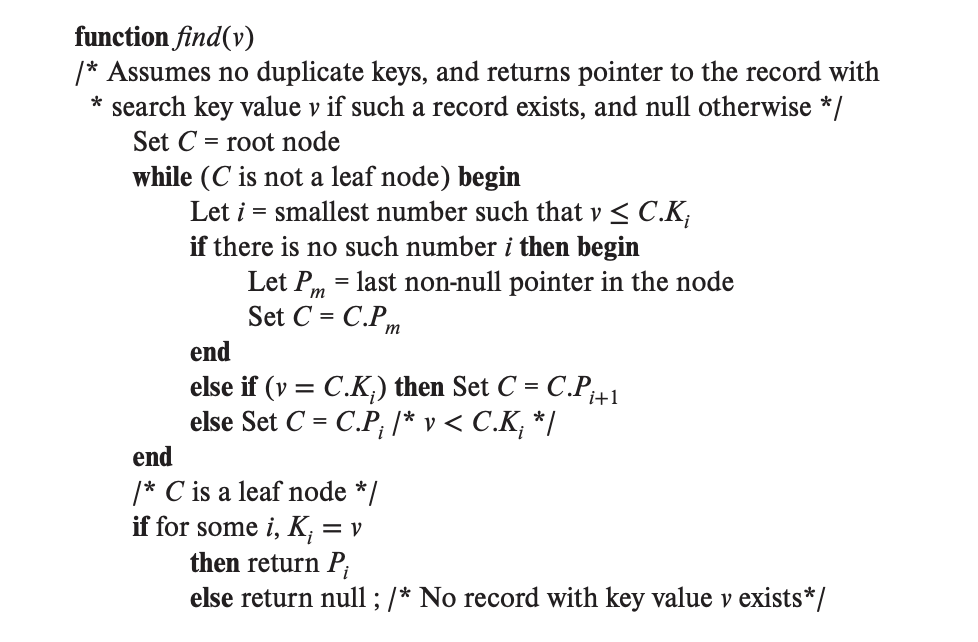
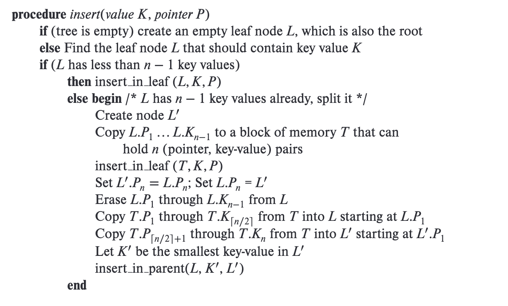
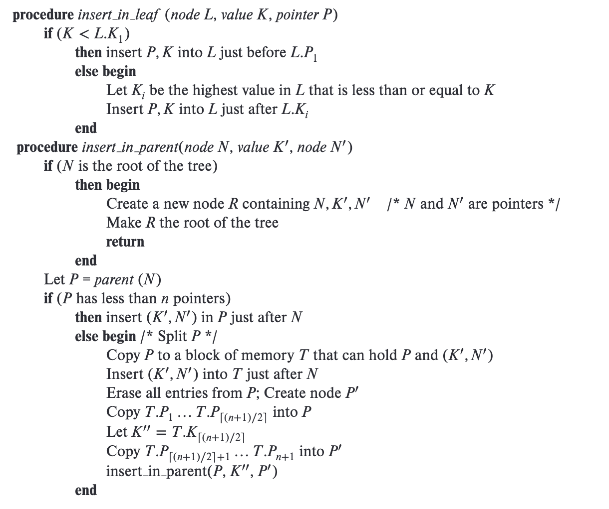
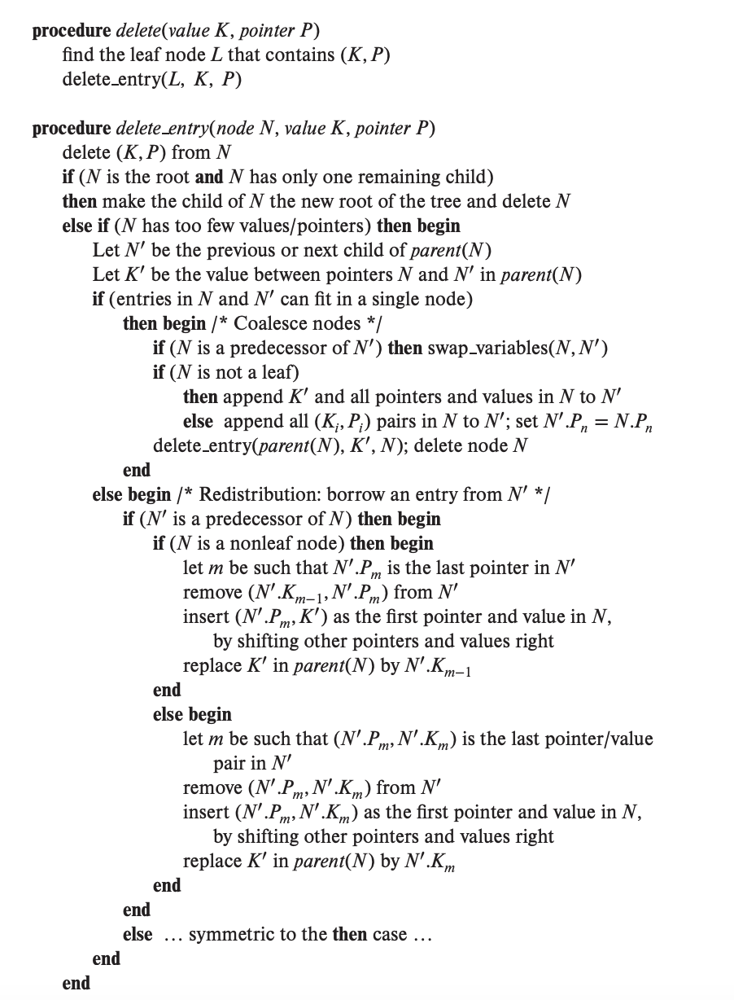
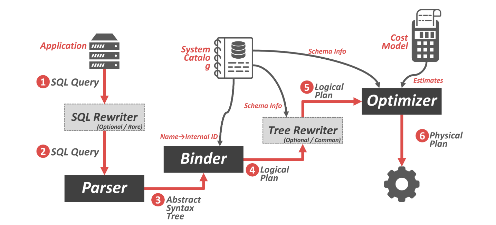
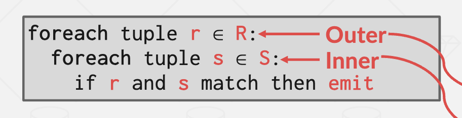
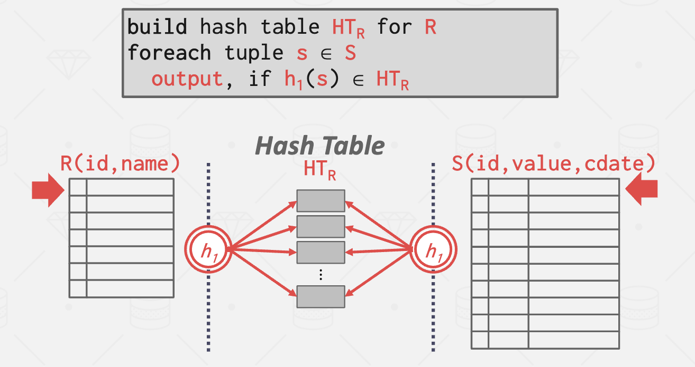
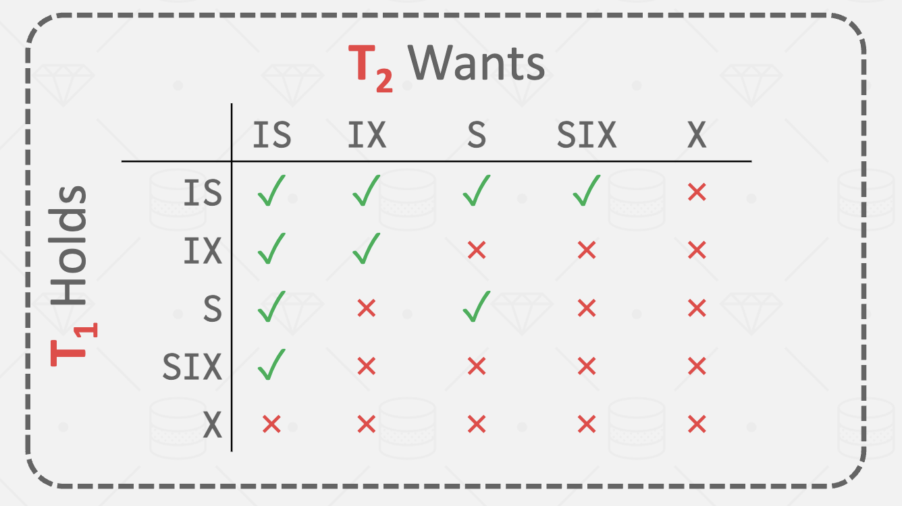

# Project Tips

## Bustub architecture


## Project0: C++ Primer

这个project的主要目的是熟悉modern C++

- 对于task1:实现一个copy-on-write的字典树，如果采用迭代法，会在remove和put的时候出现copy完parent节点，然后copy children节点，还需要更新parent指向的children节点的情况，所以更优的方案是使用递归的方法，对于key对应的路径上的每一个node进行`Clone()`, 然后递归地对于其子节点进行处理，比如在put过程中，当我们插入一个`key`的时候，对于当前遍历到的节点有：

```c++
auto copy_node = cur->Clone();
char cur_ch = key[0];
if (cur->children_.count(cur_ch)) {
  copy_node->children_[cur_ch] = PutNode(key.substr(1), value, cur->children_.at(cur_ch));
} else {
  copy_node->children_[cur_ch] = PutNode(key.substr(1), value, nullptr);
}
```

- 通过这个project，可以学到一些modern C++的用法：

  - 智能指针之间的转换

    `std::static_pointer_cast` 是 C++ 标准库中的一个函数模板，用于进行智能指针之间的静态类型转换。它的功能类似于 C++ 的静态类型转换运算符 `static_cast`，但是适用于智能指针的转换操作。

    函数签名如下：

    ```cpp
    template<class T, class U>
    std::shared_ptr<T> static_pointer_cast(const std::shared_ptr<U>& r) noexcept;
    ```

    `std::static_pointer_cast` 接受一个 `std::shared_ptr<U>` 类型的智能指针 `r`，将其转换为指定类型 `T` 的 `std::shared_ptr<T>`，并返回转换后的智能指针。

  - 对于const std::map

    `operator[]` 并不适用于常量对象，因为它可能会改变对象的内容。可以使用 `at()` 成员函数来代替 `operator[]`，因为 `at()` 支持常量对象的访问。

    例如, 在`const TrieNode`中获取其子节点：

    ```c++
    cur = cur->children_.at(ch);
    ```


## Project1: Buffer Pool

这个project的主要内容是为bustub的storage manager实现一个**buffer pool**，缓冲池负责将physical page从memory和disk之间来回移动，从而允许DBMS支持大于系统可用内存量的数据库

缓冲池的操作对系统中的其他部分是透明的。例如，系统使用页面的唯一标识符（page_id_t）向缓冲池请求页面，但它不知道该页面是否已经在内存中，也不知道系统是否必须从磁盘中检索该页面

实现必须是线程安全的，如果多个线程将同时访问内部数据结构，并且必须确保它们的关键部分受到latch的保护

### Task1: LRU-K Replacement Policy

- 实现这个算法的目的是跟踪缓冲池中的页面使用情况，在缓冲池满时选择驱逐出的页面

- LRU-k算法引入了一个参数k，它表示在计算数据项使用频率时要考虑过去的k次访问。具体来说，LRU-k维护一个大小为k的访问历史记录，记录了最近k次访问的数据项。当需要淘汰一个数据项时，LRU-k算法会选择过去第K次访问最久远的驱逐（即current timestamp和kth previous access的timestamp差距最大）
- 对于访问次数少于K次的数据项，assignment中的表述是“A frame with fewer than k historical accesses is given +inf as its backward k-distance. **When multiple frames have +inf backward k-distance, the replacer evicts the frame with the earliest overall timestamp (i.e., the frame whose least-recent recorded access is the overall least recent access, overall, out of all frames).**“，这里可以理解为按照FIFO进行驱逐，比如对于少于k次访问的数据项和大于等于k次访问的数据项，比较该数据项的第一个timestamp和其他数据项的kth previous access的timestamp，选择比较小的作为被驱逐的candidate
- `replacer_size_`: 表示`LRUKReplacer`的maximum size，等于`BufferPoolManager`中frame的数量，这并不等于evictable的数据项的数量，而`LRUKReplacer`的`Size()`接口需要返回当前evictable frames的数量，因此需要额外维护一个成员变量，并在`SetEvictable`, `Evict `和`Remove`的时候动态维护

### Task2: Buffer Pool Manager

- BufferPoolManager负责从DiskManager获取数据库页面并将其存储在内存中, 它也可以在需要时将脏页面写入磁盘。
- BufferPoolManager类中的成员变量`*pages_`维护了一个`Page`数组，代表buffer pool中的所有memory page的容器，`Page`中的成员变量`page_id`指示了`Page`对应的physical page
- BufferPoolManager类用一个`page_table_`维护了page id到frame id的映射，frame id也是LRUKReplacer中数据项的标识，BufferPoolManager类用一个`free_list_`维护了当前空闲的frame，在构造函数中，需要把所有frame都放入`frame_list_`

- BufferPoolManager类中的成员变量`disk_manager_`提供了操作disk的接口，比如在使用LRUKReplacer驱逐完页面后，如果该页面是修改过的，可以用`DiskManager::WritePage`更新到磁盘
- example：NewPage的逻辑
  - 获取一个可用的frame：
    - 函数检查是否有空闲的帧（free_list_）。如果存在空闲帧，它会从空闲帧列表中取出一个帧
    - 如果没有空闲帧，使用替换策略（LRUKReplacer）来选择一个要淘汰的帧
    - 如果帧中包含脏数据，会将脏页面写回磁盘, 然后删除页面表（page_table_）和帧表（frame_table_）中的相关记录，并更新相关的数据结构
  - 调用`AllocatePage`函数来分配一个新的页面ID（page_id_t），并将该ID存储在传入的`page_id`指针中。
  - 将新页面的信息更新到buffer pool manager中的相关数据结构中，包括`pages_` 和 page_table_。然后返回指向新页面的指针

- `UnpinPage`中，入参 `is_dirty`不能破坏已置为脏的状态,即不能将`pages_[id].is_dirty_`从true更改为false

### Task3: Read/Write Page Guards

- page guard中维护了指向 `BufferPoolManager` 和 `Page` 的指针，它的主要作用是对于Page进行管理，在类生命周期结束时自动调用`UnPinPage`，避免直接使用裸的Page对象时会忘记unpin，它的出现大大简化了下一个project B+tree的时间
- 对于page guard类，给出的接口中已经删除了拷贝构造函数和赋值运算符重载，但是需要我们自己实现移动赋值运算符`BasicPageGuard::operator=(BasicPageGuard &&that)`，在该函数中，我们需要对于类原本持有的page（如果有的话）调用`UnPinPage`，然后根据`that`更新成员变量的内容
- 在`Drop()`函数中，需要调用`UnPinPage`，于此同时在析构函数中也需要调用`Drop()`,以实现类生命周期结束时自动调用`UnPinPage`
- ReadPageGuard、WritePageGuard和BasicPageGuard的区别在于需要获取页面的`RLatch`或者`WLatch`, `FetchPageRead`和`FetchPageWrite`中，注意要获取page的读锁或写锁，并且需要在释放`BufferPoolManager`的latch之后拿，否则在project part4会造成死锁
- `FetchPageBasic` `FetchPageRead`，`FetchPageWrite`都有所复用`FetchPage`的逻辑，因此建议从`FetchPage`抽象出一个工具函数


## Project2: B+Tree

这个project的主要内容是为了bustub增加B+Tree索引的支持，索引提供了快速的数据检索，而无需搜索数据库表中的每一行，从而实现了快速的随机查找和有序记录的高效扫描。在这个project中，需要完成对于B+Tree线程安全的search, insertion, deletion操作，并完成一个可以支持in-order leaf scan的iterator

### Task1: B+Tree Pages

- `BPlusTreePage`是B+Tree中page的抽象，`BPlusTreeInternalPage`和`BPlusTreeLeafPage`分别代表B+Tree的内部节点和叶子结点

- 在`BPlusTreeInternalPage`和`BPlusTreeLeafPage`中，有这样一个成员变量：

  ```c++
  MappingType array_[0];
  ```

  这表示一个灵活数组。在 C++ 中，灵活数组成员是一种特殊的数组成员，其长度可以在运行时确定。这种技术通常用于变长结构的定义，允许在结构的尾部分配额外的空间，灵活数组必须是类中的最后一个成员变量，对于灵活数组的访问方式和普通数组一致。

  在`BPlusTreePage`中，已经对于目前的size和max_size有所记录，在对于灵活数组进行访问时，需要先用这两个成员变量进行检查，以避免访问越界

- 我在B+Tree中使用B+Tree page的接口时，链接时出现了`Undefined symbols`的报错，解决方案是把B+Tree Pages成员函数的实现放到头文件中实现

### Task2a&2b: B+Tree Insertion and Search for Single Values / B+Tree Deletions

> 在下面伪代码来自*Database System Concepts(7th Edition)*，$L、N、P$和$T$表示指向节点的指针，其中$L$用于表示叶节点。 $L . K_{i}$ 和 $L . P_{i}$分别表示节点$L$中的第$i$个值和第$i$个指针； $T .  K_{i}$ 和 $T . P_{i}$ 的用法类似。 伪代码还使用函数 $\operatorname{parent}(N)$ 来查找节点 $N$ 的父节点。

- B+Tree查找算法：

- B+Tree插入算法：		



​		首先确定需要插入的叶节点，如果插入导致分裂，向上递归处理。

- B+Tree删除算法：

- 在分裂节点的时候，对于B+树的内部节点和叶节点有什么不同：
  1. 内部节点（Internal Node）的分裂：
     - 内部节点存储的是键（Key）和指向子节点的指针。在分裂时，需要将一部分键和对应的子节点移动到一个新的节点中。
     - 分裂过程中，新节点的第一个键将成为新的分隔键（Separator Key），用于标识新节点和原节点之间的分界。
     - 新节点将成为原节点的右兄弟节点。
     - 分裂过程不会影响父节点的键值，只需要将新的分隔键插入到父节点中。
  2. 叶节点（Leaf Node）的分裂：
     - 叶节点存储的是键和对应的值。在分裂时，需要将一部分键和对应的值移动到一个新的叶节点中。
     - 分裂过程中，新节点的第一个键将成为新的右兄弟节点的第一个键。分裂过程需要更新父节点的键值，因为新的右兄弟节点的第一个键需要插入到父节点中，并成为新的分隔键。

- Page guard的使用：在操作B+Tree的page时，最好使用project1中实现的page guard，可以在超出作用域时自动释放持有的 Page 锁、进行 Unpin 操作，使用方法如下：

  ```c++
  auto page_guard = bpm_->FetchPageWrite(page_id);
  ```

  从page guard中获取可以操作的B+ tree page，可以使用page guard提供的`As()`和`AsMut()`接口，或者像assignment提示那样使用`reinterpret_cast`

  ```c++
  auto page = guard.As<BPlusTreeHeaderPage>();
  auto page = reinterpret_cast<const BPlusTreePage *>(guard.GetData());
  ```

- `Context`类的使用：可以用 `read_set_` 记录读的路径，用 `write_set_` 记录写的路径，在insert/delete 寻找叶子结点的过程中，可以用`Context`记录路径上的节点，方便在分裂/合并节点的时候向上回溯，但是注意， `read_set_` 和 `write_set_` 中记录的元素都是page guard，在从 `read_set_` 和 `write_set_` 中移除的时候会调用`UnpinPage`，因此需要判断page是safe之后，才可以从 `read_set_` 和 `write_set_` 中移除（这一点在task4中比较重要）

### Task3: An Iterator for Leaf Scans

- 在` IndexIterator`类中可以维护一个`BufferPoolManager`的实例来帮助获取page，一个指向当前leaf page guard的指针，一个迭代器在当前page中的index

### Task4: Concurrent Index

- latch crabbing原则：

  1. Search 操作下降过程中自上而下对结点加读锁。获得子结点的锁后，可立即释放父结点的锁。
  2. Insert/delete 操作下降过程中自上而下对结点加写锁。获得子结点的锁后，判断子结点是否 safe，如果是，可立即释放所有祖先结点的写锁。

  在具体实现的时候可以借助`Context`类，达成自上而下加锁的目的


## Project3: Query Execution

这个project的主要内容是为bustub增加执行query的功能，需要实现一系列的operator executor。

### Task0: 理解bustub中的Query Execution



- Parser：将SQL query转变为抽象语法树（AST）
- Binder：将查询语句与数据库元数据进行绑定，验证查询的正确性和有效性
- Planner：为查询生成逻辑计划，描述查询操作的顺序和方式
- Optimizer：对逻辑计划进行优化转换和选择最优的执行计划，以提高查询性能。

example：

假设我们有一个关系数据库表格，名为"Students"，包含以下列：

- StudentID (学生ID)
- Name (姓名)
- Age (年龄)
- Major (专业)

现在考虑以下查询语句：`SELECT Name FROM Students WHERE Major = 'Computer Science' AND Age > 20`

1. Parser首先会将此查询语句进行解析和分析，识别出关键字和语句的结构。解析器将查询语句转换为抽象语法树表示形式，如下所示：

   ```sql
         SELECT
           |
         {Name}
           |
         -------------------
         |
        WHERE
         |
      --------------
     |             |
   {Major}        {'Computer Science' AND Age > 20}
   ```

2. Binder负责根据数据库元数据，将抽象语法树中的表名和列名绑定到实际的数据库对象。在我们的例子中，Binder会验证'Major'列和'Age'列是否存在于表格"Students"中，并确保它们的正确性和类型匹配。

3. Planner根据绑定后的查询语句生成逻辑计划。在我们的例子中，planner可能会将WHERE中的谓词下推，决定先执行条件过滤，再进行选择和投影操作。生成的逻辑计划可能如下所示：

   ```sql
                 SELECT
                  |
                {Name}
                  |
               PROJECT
                  |
          ---------------
         |               |
       FILTER           SCAN
         |               |
      ------------    Students
     |            |
   {Major = 'Computer Science' AND Age > 20}
   ```

4. Optimizer会考虑不同的执行策略，并选择最优的执行计划。它会估计每个候选执行计划的成本，以便选择效果最好的策略。在我们的例子中，Optimizer可能推断根据列'Major'存在索引，候选执行计划1使用索引进行条件过滤，而候选执行计划2则需要对整个表格进行扫描。Optimizer将根据成本和统计信息选择执行计划1作为最优策略

在拿到 Optimizer 生成的具体的执行计划后，就可以生成真正执行计划的一系列executor了。

#### execution engine

bustub中execution engine执行的关键逻辑在`Execute()`函数中（`execution_engine.h`中）：

```c++
  auto Execute(const AbstractPlanNodeRef &plan, std::vector<Tuple> *result_set, Transaction *txn,
               ExecutorContext *exec_ctx) -> bool {
    BUSTUB_ASSERT((txn == exec_ctx->GetTransaction()), "Broken Invariant");

    // Construct the executor for the abstract plan node
    auto executor = ExecutorFactory::CreateExecutor(exec_ctx, plan);

    // Initialize the executor
    auto executor_succeeded = true;

    try {
      executor->Init();
      PollExecutor(executor.get(), plan, result_set);
      PerformChecks(exec_ctx);
    } catch (const ExecutionException &ex) {
      executor_succeeded = false;
      if (result_set != nullptr) {
        result_set->clear();
      }
    }

    return executor_succeeded;
  }
```

BusTub 采用了 Top-to-Bottom 的火山模型

- `ExecutorFactory::CreateExecutor`： 根据AbstractPlan递归创建Executor
- `PollExecutor`: 逐步执行查询计划，实际上就是调用了executor的`Next()`方法
- `PerformChecks`: 用于执行某些额外的检查，比如检查 NestedLoopJoin 是不是 Pipeline Breaker

#### 一些重要的类

- Catalog: 记录了整个数据库中的table和index信息。

- Index: 索引，也是project2中实现的`BPlusTreeIndex`的基类

- TableHeap: 代表了磁盘上的物理页，是由table page构成的双向链表，提供了一些更新table中的tuple的接口：`InsertTuple`, `UpdateTupleMeta`等

- TableHeapIterator：用于对TableHeap进行遍历

- Schema：本质是vector of columns。它描述了一个tuple内存储的数据格式

- Column：包含该column的名字、类型、长度等信息

- Tuple：存储了一行数据。它包含Data和RID。**注意，tuple中不存储schema**

- Value：表示一个值（Int、Char、Varchar等）

- RID: 记录tuple的存储位置, 包括page id+slot id。


### Task1:  Access Method Executors

- task1中需要实现SeqScan、Insert、Update、Delete 和 IndexScan五个算子
- 对于Delete算子，逻辑是先删除，后插入，在生成需要插入的new value时，可以参考`ProjectionExecutor::Next()`中的逻辑

### Task2 : Aggregation & Join Executors

- tsak2中需要实现Aggregation、NestedLoopJoin、HashJoin和NLJ_as_hash_join这个优化规则

- NestedLoopJoin的逻辑：

  对于外层表中的每一个tuple，都要和内层表的每一个tuple进行匹配
  
  
  
  `performChecks`中会检查NestedLoopJoin满足不是Pipeline Breaker的条件，要求 NestedLoopJoin 左子节点每次调用 `Next()` 方法后，右子节点都需要再 `Init()` 一次
  
  这里要求同时支持left join和inner join：
  
  1. 内连接（inner join）只输出两个表中匹配的行。
  2. 左连接（left join）是在inner join的基础上，还会包含左表中的所有行，即使在右表中没有匹配的行。如果左表的某一行在右表中找不到匹配的行，则右表的结果将为空值（NULL）。左连接的结果集包含了左表的所有行以及与之匹配的右表的行。

- HashJoin的逻辑：

  

  - 因为这里需要同时支持inner join和left join，因此要对右表做hash而不是左表
  - 这里还需要确定怎么哈希，这里我维护了一个unordered_map，复用了`AggregateKey`作为hash key

- 当完成HashJoin后，这个executor并不会得到调用，还需要修改optimizer将NestedLoopJoinPlanNode转换为HashJoinPlanNode，将NestedLoopJoinPlanNode转换为HashJoinPlanNode需要满足两个条件：

  - predicate中一个等于条件

    ```sql
    SELECT * FROM test_1 t1, test_2 t2 WHERE t1.colA = t2.colA
    ```

  - predicate中有两个等于条件并且用一个AND连接

    ```sql
    SELECT * FROM test_1 t1, test_2 t2 WHERE t1.colA = t2.colA AND t1.colB = t2.colC;
    ```

​			在git history中可以看到*predicate中一个等于条件*的实现版本，可以仿照该版本实现同时支持两个等于条件的

### Task3 : Sort + Limit Executors and Top-N Optimization

- task3中需要实现Sort、Limit 和 TopN这三个算子，以及将 Limit + Sort 在 Optimizer 中优化为 TopN的规则

### DEBUG

- column的ToString方法：

  ```c++
    auto ToString() const -> std::string override { return fmt::format("#{}.{}", tuple_idx_, col_idx_); }
  ```

- plan的ToString方法：

  ```c++
  auto ToString(bool with_schema = true) const -> std::string {
      if (with_schema) {
        return fmt::format("{} | {}{}", PlanNodeToString(), output_schema_, ChildrenToString(2, with_schema));
      }
      return fmt::format("{}{}", PlanNodeToString(), ChildrenToString(2, with_schema));
  }
  ```


## Project4: Concurrency Control		

这个project的主要内容是

- 实现一个lock manager并将其用于并发查询执行，lock manager将处理来自事务的锁请求，向事务授予锁，并根据事务的隔离级别检查是否适当释放了锁。

- lock manager需要支持table lock和tuple lock，和以下五种模式

  - intention-shared

  - intention-exclusive

  - shared-intention-exclusive

  - shared

  - exclusive

### Task1: Lock Manager

- bustub中有一个全局的lock manager，当事务尝试访问或修改tuple时，`TableHeap`和`Executor`类将使用lock manager来获取tuple上的锁（通过rid）

- 在lock manager中，需要先拿`lock request queue`的锁再放`lock table`的锁，不然会有可能发生竞争

- 锁的兼容性矩阵，判断一个线程拿锁的时候另一个线程是否可以拿锁：

  

- 在对于`*_lock_map_`和`LockRequestQueue`中的元素进行操作的时候都需要拿锁，因此在abort的时候，切记要把当前所拿的锁放掉，不然会死锁
- example：lock table的基本步骤：
  1. 函数首先检查传递给它的事务指针 `txn` 是否为 `nullptr`，如果为 `nullptr`，则返回 `false`，表示操作失败。
  2. 检查事务的隔离级别是否符合锁的要求。
  3. 获得对应于 `oid` 的`lock request queue`。
  4. 接下来，该操作是否是锁的升级操作，如果有锁的升级操作，会执行以下操作：
     - 检查升级是否合法，即当前锁模式是否可以升级到目标锁模式。
     - 如果升级不合法，将当前事务标记为已中止（`ABORTED`），释放锁请求队列的互斥锁，然后抛出异常
     - 否则，将当前请求从锁请求队列中删除，并释放之前持有的锁。然后标记队列中的升级操作正在进行中。
  5. 如果当前请求是升级请求，则将其插入到第一个没有granted的请求前，以确保升级请求被优先处理。如果是新的锁请求，将其追加到请求队列的末尾。
  6. 然后，释放`lock request queue`的lock，并使用一个conditional variable在`lock request queue`等待，直到拿到锁或者被abort（如果发生了死锁，task2中实现的死锁检测时有可能将该请求abort）
  7. 当锁请求成功获得时，将锁请求标记为已授予（`granted_` 设置为 `true`），然后释放锁请求队列的互斥锁。
  8. 最后，函数返回 `true` 表示成功获取锁，或返回 `false` 表示操作失败。

### Task2: Deadlock Detection

- 这一步的主要任务是在一个background线程中，定期对于当前线程的拿锁/等待情况构建wait-for graph，DFS遍历wait-for graph，如果发现了环就说明出现了死锁

- 在DFS遍历时，可以使用提供的函数签名来实现

  ```c++
  auto FindCycle(txn_id_t source_txn, std::vector<txn_id_t> &path, std::unordered_set<txn_id_t> &on_path,
                 std::unordered_set<txn_id_t> &visited, txn_id_t *abort_txn_id) -> bool;
  ```

### Task3: Concurrent Query Execution

- 这里需要对于SeqScan Executor/Insert Executor/Delete Executor进行修改，以支持并发的query执行
- note中对于什么时候需要拿什么锁做了详细的解释，有一个需要特别需要注意的地方：
  - 对于SeqScan Executor，如果`exec_ctx_->IsDelete()`为true，对于table就需要获取intention exclusive lock, tuple需要获取exclusive lock，不论现在的isolation level是什么
- 在Transaction Manager中，对于Abort需要实现回滚修改的逻辑，对于`TableWriteRecord`，需要使用`UpdateTupleMeta`对tuple进行插入/删除的逆操作，对于`IndexWriteRecord`，可以参考git history中的实现，对于index进行相应插入/删除的逆操作


## Reference

- 课程网站：[Assignments | CMU 15-445/645 :: Intro to Database Systems (Spring 2023)](https://15445.courses.cs.cmu.edu/spring2023/assignments.html)
- 码呆茶大佬的2023 spring版本的blog：[CMU 15-445 | 2023 - 知乎 (zhihu.com)](https://www.zhihu.com/column/c_1618291703873589248)
- Eleven大佬的2022 fall版本的blog：[Eleven's Blog](https://blog.eleven.wiki/)
- project 3 bustub架构分析：[CMU15-445 Lab3 Query Execution全记录 - sun-lingyu - 博客园 (cnblogs.com)](https://www.cnblogs.com/sun-lingyu/p/15316626.html)

